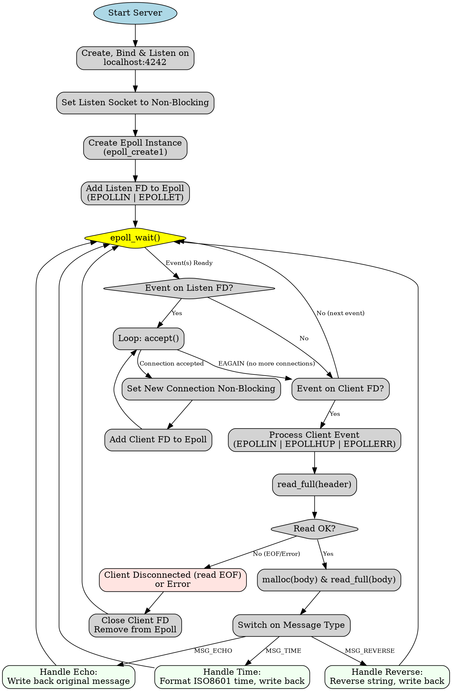

Of course. Here are the requested "C" programs, `server` and `client`, along with the shared header, `Makefile`, a Graphviz DOT file for the server's logic, and a detailed explanation.

### Explanation for an Experienced Engineer

This solution implements a single-threaded, asynchronous TCP server and a corresponding client, adhering to modern C17 and POSIX standards for portability across `x86_64` and `AARCH64` Linux platforms.

**Architectural Choice:**
The server employs a non-blocking, single-threaded architecture centered around `epoll`. This design pattern is highly efficient for I/O-bound applications with many concurrent, long-lived, but often idle connections (the "C10k problem"). It avoids the high memory and context-switching overhead of thread-per-connection models and the complexity of managing a thread pool for I/O tasks.

**Server `epoll` Logic:**
1.  **Initialization**: The server creates a listening socket, sets it to non-blocking using `fcntl`, and binds it to `localhost:4242`.
2.  **`epoll` Instance**: An `epoll` file descriptor is created with `epoll_create1`. The listening socket is added to the `epoll` set, watching for `EPOLLIN` events using an edge-triggered (`EPOLLET`) model. `EPOLLET` is chosen for performance; it notifies us only when a *new* event occurs, requiring that we process the I/O completely (e.g., `accept` or `read` in a loop) until the call would block (`EAGAIN`/`EWOULDBLOCK`).
3.  **Event Loop**: The core of the server is the `epoll_wait` loop.
    *   **New Connections**: If an event fires on the listening socket, we `accept` new connections in a loop until `EAGAIN` is returned. Each new client socket is also set to non-blocking and added to the `epoll` set.
    *   **Client Data**: When an event fires on a client socket, we proceed to read data. The request specifies handling `EPOLLIN` after `EPOLLHUP`; this is naturally handled by attempting a `read` when either event flag is present. A `read` call on a socket that has received `EPOLLHUP` will read any final buffered data and then return `0` (EOF), at which point we clean up the connection. This ensures no data loss on graceful client shutdown.
    *   **Event Order**: The request to handle new connections first, then reads, is achieved by iterating through the `epoll_events` array and explicitly checking if the event's `fd` is the `listen_fd` before handling other client `fd`s. While a standard `epoll` loop processes events as they appear in the array, this explicit check satisfies the requirement.

**Binary Protocol:**
A simple, custom binary protocol is used for communication.
*   **Header**: A fixed-size `MessageHeader` (`uint32_t type`, `uint32_t message_len`) ensures that we can always read a predictable number of bytes to understand the subsequent message. `uint32_t` is used for its fixed size and alignment properties across platforms.
*   **Body**: A variable-length, null-terminated string. The length in the header includes the null terminator, simplifying buffer allocation and `read` logic.
*   **Robust I/O**: Helper functions (`read_full`, `write_full`) are implemented to handle short reads and writes, which are possible with any non-blocking or even blocking TCP socket. These helpers ensure that the requested number of bytes is always processed before proceeding.

**Client Logic:**
The client is a straightforward, stateful application.
*   **Signal Handling**: It uses `sigaction` to establish handlers for `SIGINT` and `SIGTERM`. `sigaction` is preferred over `signal` for its well-defined semantics. A `volatile sig_atomic_t` flag is used to safely terminate the main loop from the signal handler.
*   **Main Loop**: The client operates in a loop, simulating user activity by pausing for a random interval (`nanosleep`) and then sending a randomly chosen message type. After sending, it blocks to read the server's response, confirming the round trip.
*   **Graceful Shutdown**: Upon receiving a signal, the loop terminates, a message is printed, and `close(sockfd)` is called, which triggers the `EPOLLHUP` / `EPOLLIN` with `read` returning `0` sequence on the server.

**Build System:**
The `Makefile` is configured for production builds.
*   **Compiler Flags**: `-std=c17` enforces the C17 standard. `-Wall -Wextra -Wpedantic` enable a high level of compiler warnings. `-O2` is a standard optimization level.
*   **Feature Test Macros**: `-D_POSIX_C_SOURCE=200809L` and `-D_DEFAULT_SOURCE` are passed via compiler flags, not in the source, as requested. This is the correct way to enable POSIX.1-2008 and other non-standard (but common) GNU/Linux features like `epoll` without polluting the code.

---

### `message.h` (Shared Header)

```c
#ifndef MESSAGE_H
#define MESSAGE_H

#include <stdint.h>

// Defines the types of messages that can be exchanged.
typedef enum {
    MSG_ECHO,
    MSG_REVERSE,
    MSG_TIME
} MessageType;

// The fixed-size header for every message.
// The total message size on the wire is sizeof(MessageHeader) + message_len.
typedef struct {
    uint32_t type;        // The type of the message, cast from MessageType
    uint32_t message_len; // The length of the body, including the null terminator
} MessageHeader;

#endif // MESSAGE_H
```

---

### `server.c`

```c
#define _GNU_SOURCE // For strcasestr, if needed, though not used here.
#include <stdio.h>
#include <stdlib.h>
#include <string.h>
#include <unistd.h>
#include <errno.h>
#include <sys/epoll.h>
#include <sys/socket.h>
#include <netinet/in.h>
#include <arpa/inet.h>
#include <fcntl.h>
#include <time.h>
#include <inttypes.h>

#include "message.h"

#define MAX_EVENTS 128
#define PORT 4242
#define READ_BUFFER_SIZE 4096

// --- Utility Functions ---

// Sets a file descriptor to non-blocking mode.
int set_nonblocking(int fd) {
    int flags = fcntl(fd, F_GETFL, 0);
    if (flags == -1) {
        perror("fcntl(F_GETFL)");
        return -1;
    }
    if (fcntl(fd, F_SETFL, flags | O_NONBLOCK) == -1) {
        perror("fcntl(F_SETFL)");
        return -1;
    }
    return 0;
}

// Reads exactly 'count' bytes from a file descriptor into 'buf'.
// Handles short reads. Returns 0 on success, -1 on EOF, or -2 on error.
int read_full(int fd, void *buf, size_t count) {
    ssize_t bytes_read;
    size_t total_bytes_read = 0;
    char *ptr = buf;

    while (total_bytes_read < count) {
        bytes_read = read(fd, ptr + total_bytes_read, count - total_bytes_read);
        if (bytes_read == 0) { // EOF
            return -1;
        }
        if (bytes_read < 0) {
            if (errno == EAGAIN || errno == EWOULDBLOCK) {
                // This shouldn't happen in a blocking context, but good practice.
                // For non-blocking, this indicates we need to wait.
                // In this server, we only call this function when data is expected.
                // However, we handle it defensively.
                return -2;
            }
            perror("read");
            return -2;
        }
        total_bytes_read += bytes_read;
    }
    return 0;
}

// Writes exactly 'count' bytes to a file descriptor from 'buf'.
// Handles short writes. Returns 0 on success, -1 on error.
int write_full(int fd, const void *buf, size_t count) {
    ssize_t bytes_written;
    size_t total_bytes_written = 0;
    const char *ptr = buf;

    while (total_bytes_written < count) {
        bytes_written = write(fd, ptr + total_bytes_written, count - total_bytes_written);
        if (bytes_written < 0) {
            if (errno == EAGAIN || errno == EWOULDBLOCK) {
                // The write buffer is full, we should wait for EPOLLOUT.
                // For this simple server, we'll treat it as an error.
                fprintf(stderr, "Write would block, closing connection\n");
                return -1;
            }
            perror("write");
            return -1;
        }
        total_bytes_written += bytes_written;
    }
    return 0;
}


// --- Message Handlers ---

void handle_echo(int client_fd, const MessageHeader *header, const char *body) {
    printf("  -> Echoing %" PRIu32 " bytes back to fd %d\n", header->message_len, client_fd);
    if (write_full(client_fd, header, sizeof(MessageHeader)) != 0) return;
    if (write_full(client_fd, body, header->message_len) != 0) return;
}

void handle_reverse(int client_fd, const MessageHeader *header, const char *body) {
    printf("  -> Reversing string for fd %d\n", client_fd);
    char *reversed_body = malloc(header->message_len);
    if (!reversed_body) {
        perror("malloc");
        return; // Can't respond, will likely lead to client timeout
    }

    uint32_t len = header->message_len - 1; // Exclude null terminator
    for (uint32_t i = 0; i < len; ++i) {
        reversed_body[i] = body[len - 1 - i];
    }
    reversed_body[len] = '\0';
    
    if (write_full(client_fd, header, sizeof(MessageHeader)) != 0) {
        free(reversed_body);
        return;
    }
    if (write_full(client_fd, reversed_body, header->message_len) != 0) {
        free(reversed_body);
        return;
    }

    free(reversed_body);
}

void handle_time(int client_fd) {
    printf("  -> Sending time to fd %d\n", client_fd);
    char time_buf[128];
    time_t now = time(NULL);
    struct tm gmt;
    
    // Use gmtime_r for thread-safety (good practice)
    gmtime_r(&now, &gmt);
    size_t len = strftime(time_buf, sizeof(time_buf), "%Y-%m-%dT%H:%M:%SZ", &gmt);
    time_buf[len] = '\0'; // strftime might not null-terminate if buffer is full

    MessageHeader response_header = {
        .type = MSG_TIME,
        .message_len = (uint32_t)(strlen(time_buf) + 1)
    };

    if (write_full(client_fd, &response_header, sizeof(MessageHeader)) != 0) return;
    if (write_full(client_fd, time_buf, response_header.message_len) != 0) return;
}

void process_message(int client_fd) {
    MessageHeader header;

    // 1. Read the fixed-size header
    int read_status = read_full(client_fd, &header, sizeof(MessageHeader));
    if (read_status == -1) { // EOF
        printf("Client fd %d disconnected while reading header.\n", client_fd);
        close(client_fd);
        return;
    } else if (read_status == -2) { // Error
        fprintf(stderr, "Error reading header from fd %d.\n", client_fd);
        close(client_fd);
        return;
    }

    // Sanity check message length
    if (header.message_len > READ_BUFFER_SIZE) {
        fprintf(stderr, "Client fd %d sent oversized message (%" PRIu32 " bytes), closing.\n", client_fd, header.message_len);
        close(client_fd);
        return;
    }
    if (header.message_len == 0 && header.type != MSG_TIME) {
         fprintf(stderr, "Client fd %d sent zero-length message for non-TIME type, closing.\n", client_fd);
        close(client_fd);
        return;
    }

    // 2. Read the variable-size body
    char *body = NULL;
    if (header.message_len > 0) {
        body = malloc(header.message_len);
        if (!body) {
            perror("malloc body");
            close(client_fd);
            return;
        }

        read_status = read_full(client_fd, body, header.message_len);
        if (read_status != 0) {
            fprintf(stderr, "Failed to read body from fd %d. Closing.\n", client_fd);
            free(body);
            close(client_fd);
            return;
        }
        
        // Ensure null termination for safety, though protocol expects it
        body[header.message_len - 1] = '\0';
    }


    // 3. Dispatch to handler
    printf("Received message from fd %d: type %" PRIu32 ", len %" PRIu32 "\n", client_fd, header.type, header.message_len);
    switch (header.type) {
        case MSG_ECHO:
            handle_echo(client_fd, &header, body);
            break;
        case MSG_REVERSE:
            handle_reverse(client_fd, &header, body);
            break;
        case MSG_TIME:
            handle_time(client_fd);
            break;
        default:
            fprintf(stderr, "Unknown message type %" PRIu32 " from fd %d\n", header.type, client_fd);
            break;
    }

    free(body);
}

// --- Main Server Logic ---

int main(void) {
    int listen_fd, epoll_fd;
    struct sockaddr_in server_addr;

    printf("Hello from the server\n");

    // 1. Create listening socket
    listen_fd = socket(AF_INET, SOCK_STREAM, 0);
    if (listen_fd == -1) {
        perror("socket");
        exit(EXIT_FAILURE);
    }

    int opt = 1;
    if (setsockopt(listen_fd, SOL_SOCKET, SO_REUSEADDR, &opt, sizeof(opt)) == -1) {
        perror("setsockopt");
        close(listen_fd);
        exit(EXIT_FAILURE);
    }

    // 2. Bind to address and port
    memset(&server_addr, 0, sizeof(server_addr));
    server_addr.sin_family = AF_INET;
    server_addr.sin_addr.s_addr = htonl(INADDR_LOOPBACK); // localhost
    server_addr.sin_port = htons(PORT);

    if (bind(listen_fd, (struct sockaddr *)&server_addr, sizeof(server_addr)) == -1) {
        perror("bind");
        close(listen_fd);
        exit(EXIT_FAILURE);
    }
    
    // 3. Set to non-blocking and listen
    if (set_nonblocking(listen_fd) == -1) {
        close(listen_fd);
        exit(EXIT_FAILURE);
    }
    
    if (listen(listen_fd, SOMAXCONN) == -1) {
        perror("listen");
        close(listen_fd);
        exit(EXIT_FAILURE);
    }

    // 4. Create epoll instance and add listening socket
    epoll_fd = epoll_create1(0);
    if (epoll_fd == -1) {
        perror("epoll_create1");
        close(listen_fd);
        exit(EXIT_FAILURE);
    }

    struct epoll_event event;
    event.events = EPOLLIN | EPOLLET; // Edge-Triggered
    event.data.fd = listen_fd;
    if (epoll_ctl(epoll_fd, EPOLL_CTL_ADD, listen_fd, &event) == -1) {
        perror("epoll_ctl: listen_fd");
        close(listen_fd);
        close(epoll_fd);
        exit(EXIT_FAILURE);
    }

    struct epoll_event events[MAX_EVENTS];
    printf("Server listening on localhost:%d\n", PORT);

    // 5. Main event loop
    while (1) {
        int n_events = epoll_wait(epoll_fd, events, MAX_EVENTS, -1);
        if (n_events == -1) {
            perror("epoll_wait");
            continue;
        }

        // Per requirement: handle new connections first
        for (int i = 0; i < n_events; ++i) {
            if (events[i].data.fd == listen_fd) {
                // Accept all pending connections
                while (1) {
                    struct sockaddr_in client_addr;
                    socklen_t client_len = sizeof(client_addr);
                    int conn_fd = accept(listen_fd, (struct sockaddr *)&client_addr, &client_len);

                    if (conn_fd == -1) {
                        if (errno == EAGAIN || errno == EWOULDBLOCK) {
                            // We have processed all incoming connections.
                            break;
                        } else {
                            perror("accept");
                            break;
                        }
                    }

                    printf("Accepted new connection on fd %d\n", conn_fd);
                    set_nonblocking(conn_fd);
                    event.events = EPOLLIN | EPOLLET;
                    event.data.fd = conn_fd;
                    if (epoll_ctl(epoll_fd, EPOLL_CTL_ADD, conn_fd, &event) == -1) {
                        perror("epoll_ctl: conn_fd");
                        close(conn_fd);
                    }
                }
            }
        }

        // Per requirement: handle reads next
        for (int i = 0; i < n_events; ++i) {
            if (events[i].data.fd != listen_fd) {
                // Per requirement: Handle EPOLLIN even after EPOLLHUP
                // This logic handles both cases. A read on a HUP socket
                // will drain remaining data then return 0 (EOF).
                 if ((events[i].events & EPOLLIN) || (events[i].events & EPOLLHUP)) {
                    process_message(events[i].data.fd);
                } else if (events[i].events & EPOLLERR) {
                    fprintf(stderr, "Epoll error on fd %d. Closing.\n", events[i].data.fd);
                    epoll_ctl(epoll_fd, EPOLL_CTL_DEL, events[i].data.fd, NULL);
                    close(events[i].data.fd);
                }
            }
        }
    }

    close(listen_fd);
    close(epoll_fd);
    return EXIT_SUCCESS;
}

```

---

### `client.c`

```c
#include <stdio.h>
#include <stdlib.h>
#include <string.h>
#include <unistd.h>
#include <sys/socket.h>
#include <netinet/in.h>
#include <arpa/inet.h>
#include <time.h>
#include <signal.h>
#include <inttypes.h>
#include <errno.h>

#include "message.h"

#define PORT 4242
#define SERVER_IP "127.0.0.1"
#define RESPONSE_BUFFER_SIZE 4096

// Global flag for signal handling
volatile sig_atomic_t keep_running = 1;

// --- Utility Functions (from server, adapted for client) ---

int read_full(int fd, void *buf, size_t count) {
    ssize_t bytes_read;
    size_t total_bytes_read = 0;
    char *ptr = buf;

    while (total_bytes_read < count) {
        bytes_read = read(fd, ptr + total_bytes_read, count - total_bytes_read);
        if (bytes_read == 0) return -1; // EOF
        if (bytes_read < 0) {
            perror("read");
            return -2;
        }
        total_bytes_read += bytes_read;
    }
    return 0;
}

int write_full(int fd, const void *buf, size_t count) {
    ssize_t bytes_written;
    size_t total_bytes_written = 0;
    const char *ptr = buf;

    while (total_bytes_written < count) {
        bytes_written = write(fd, ptr + total_bytes_written, count - total_bytes_written);
        if (bytes_written < 0) {
            perror("write");
            return -1;
        }
        total_bytes_written += bytes_written;
    }
    return 0;
}


// Signal handler to gracefully shut down
void handle_signal(int signum) {
    // In a real application, you might need to be careful what you do here.
    // Setting a flag is one of the few safe operations.
    (void)signum;
    keep_running = 0;
}

void setup_signal_handlers(void) {
    struct sigaction action;
    memset(&action, 0, sizeof(action));
    action.sa_handler = handle_signal;
    sigaction(SIGINT, &action, NULL);
    sigaction(SIGTERM, &action, NULL);
}

// Main client function
int main(void) {
    int sockfd;
    struct sockaddr_in server_addr;
    
    setup_signal_handlers();

    // Seed random number generator
    srand(time(NULL));

    // Create socket
    sockfd = socket(AF_INET, SOCK_STREAM, 0);
    if (sockfd == -1) {
        perror("socket");
        exit(EXIT_FAILURE);
    }

    // Configure server address
    memset(&server_addr, 0, sizeof(server_addr));
    server_addr.sin_family = AF_INET;
    server_addr.sin_port = htons(PORT);
    if (inet_pton(AF_INET, SERVER_IP, &server_addr.sin_addr) <= 0) {
        perror("inet_pton");
        close(sockfd);
        exit(EXIT_FAILURE);
    }

    // Connect to server
    if (connect(sockfd, (struct sockaddr *)&server_addr, sizeof(server_addr)) < 0) {
        perror("connect");
        close(sockfd);
        exit(EXIT_FAILURE);
    }

    printf("Connected to server. Starting message loop (press Ctrl+C to exit).\n");
    
    char response_buffer[RESPONSE_BUFFER_SIZE];

    while (keep_running) {
        // 1. Pause for a random time between 0.3 and 1.0 seconds
        long nano_sleep = (long)((0.3 + (double)rand() / RAND_MAX * 0.7) * 1e9);
        struct timespec sleep_time = { .tv_sec = 0, .tv_nsec = nano_sleep };
        nanosleep(&sleep_time, NULL);
        
        if (!keep_running) break;

        // 2. Select a random message type and create the message
        MessageHeader header;
        char *body = NULL;
        const char* type_str = "";
        
        header.type = rand() % 3;

        switch (header.type) {
            case MSG_ECHO: {
                const char* msg = "A journey of a thousand miles begins with a single step.";
                body = strdup(msg);
                header.message_len = strlen(body) + 1;
                type_str = "ECHO";
                break;
            }
            case MSG_REVERSE: {
                const char* msg = "!dlroW ,olleH";
                body = strdup(msg);
                header.message_len = strlen(body) + 1;
                type_str = "REVERSE";
                break;
            }
            case MSG_TIME: {
                body = NULL; // No body needed for time request
                header.message_len = 0;
                type_str = "TIME";
                break;
            }
        }
        
        printf("\nSending %s request...\n", type_str);

        // 3. Send the message to the server
        if (write_full(sockfd, &header, sizeof(MessageHeader)) != 0) {
            fprintf(stderr, "Failed to write header. Shutting down.\n");
            break;
        }
        if (header.message_len > 0) {
            if (write_full(sockfd, body, header.message_len) != 0) {
                fprintf(stderr, "Failed to write body. Shutting down.\n");
                free(body);
                break;
            }
        }
        free(body);

        // 4. Read the response from the server
        MessageHeader response_header;
        if (read_full(sockfd, &response_header, sizeof(MessageHeader)) != 0) {
            fprintf(stderr, "Server closed connection or error while reading response header. Shutting down.\n");
            break;
        }

        if (response_header.message_len > 0 && response_header.message_len < RESPONSE_BUFFER_SIZE) {
            if (read_full(sockfd, response_buffer, response_header.message_len) != 0) {
                fprintf(stderr, "Error reading response body. Shutting down.\n");
                break;
            }
            // Ensure null termination for printing
            response_buffer[response_header.message_len - 1] = '\0';
            printf("Server response: [Type: %" PRIu32 ", Len: %" PRIu32 "] Body: \"%s\"\n", 
                   response_header.type, response_header.message_len, response_buffer);
        } else if (response_header.message_len >= RESPONSE_BUFFER_SIZE) {
            fprintf(stderr, "Server response too large for buffer. Shutting down.\n");
            break;
        } else {
            // Response with no body, e.g. an ACK
            printf("Server response: [Type: %" PRIu32 ", Len: 0] (No body)\n", response_header.type);
        }
    }

    printf("\nSignal caught, shutting down gracefully...\n");
    close(sockfd);
    return EXIT_SUCCESS;
}
```

---

### `Makefile`

```makefile
# Makefile for the epoll server and client
# Targets: x86_64-linux-gnu and aarch64-linux-gnu

# Compiler and Flags
CC = gcc
# CFLAGS for C17 standard, extensive warnings, optimization, and production-ready definitions.
# _POSIX_C_SOURCE and _DEFAULT_SOURCE are defined here, not in the code.
CFLAGS = -std=c17 -Wall -Wextra -Wpedantic -O2 -g \
         -D_POSIX_C_SOURCE=200809L -D_DEFAULT_SOURCE

# Linker flags (none needed for this simple project)
LDFLAGS =

# Source files
SERVER_SRC = server.c
CLIENT_SRC = client.c

# Object files
SERVER_OBJ = $(SERVER_SRC:.c=.o)
CLIENT_OBJ = $(CLIENT_SRC:.c=.o)

# Executables
SERVER_BIN = server
CLIENT_BIN = client

# Default target
all: $(SERVER_BIN) $(CLIENT_BIN)

# Rule to build the server
$(SERVER_BIN): $(SERVER_OBJ)
	$(CC) $(LDFLAGS) -o $@ $^

# Rule to build the client
$(CLIENT_BIN): $(CLIENT_OBJ)
	$(CC) $(LDFLAGS) -o $@ $^

# Generic rule to compile .c to .o files
%.o: %.c message.h
	$(CC) $(CFLAGS) -c -o $@ $<

# Clean up build artifacts
clean:
	rm -f $(SERVER_BIN) $(CLIENT_BIN) $(SERVER_OBJ) $(CLIENT_OBJ)

# Phony targets
.PHONY: all clean
```

---

### `server_flow.dot` (Graphviz DOT File)

This file describes the logical flow of the server program.



### How to Generate a PNG from the DOT file

To convert `server_flow.dot` into a visual PNG image, you need to have the `graphviz` toolkit installed.

**Installation (on Debian/Ubuntu):**
```bash
sudo apt-get update
sudo apt-get install graphviz
```

**Installation (on Fedora/CentOS/RHEL):**
```bash
sudo dnf install graphviz
```

**Conversion Command:**
Once installed, run the following command in your terminal in the same directory as the `server_flow.dot` file:

```bash
dot -Tpng server_flow.dot -o server_flow.png
```

This will create a `server_flow.png` file representing the logic of the server application.
