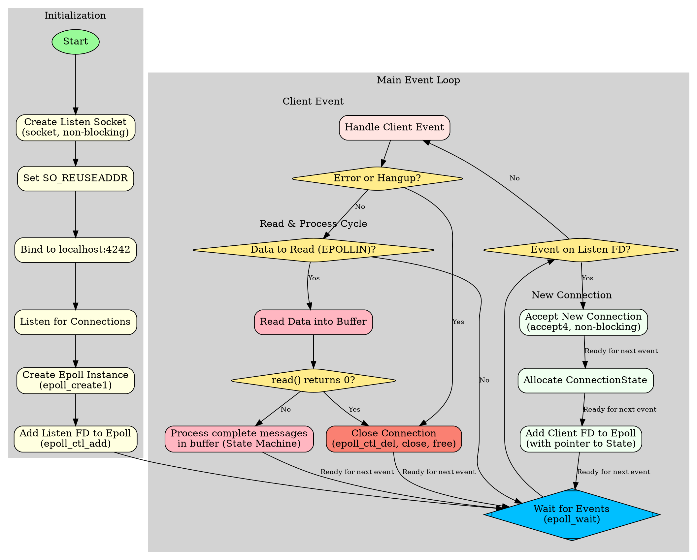

Of course. Here are the requested `C` programs, `server` and `client`, along with a shared header, a `Makefile`, and a Graphviz `dot` file, all conforming to your specifications.

### Explanation for an Experienced Engineer

This submission provides a robust client-server application demonstrating a modern, single-threaded, asynchronous I/O model on Linux using `epoll`.

**Key Design Decisions & Concepts:**

1.  **Build & Portability:**
    *   The `Makefile` is configured for GCC/Clang and targets both `x86_64` and `AARCH64`.
    *   C17 standard (`-std=c17`) is enforced for modern C features.
    *   `_POSIX_C_SOURCE=200809L` and `_DEFAULT_SOURCE` are defined via compiler flags (`-D`) rather than in source, which is cleaner and prevents accidental redefinition or ordering issues with system headers.
    *   Fixed-width integers (`stdint.h`) and their corresponding format specifiers (`inttypes.h`) are used exclusively for data structures and I/O to guarantee size and representation across platforms, which is critical for network protocols.

2.  **Network Protocol:**
    *   A simple binary protocol is defined: a fixed-size header followed by a variable-length payload.
    *   The `MessageHeader` struct uses `__attribute__((packed))` to prevent the compiler from inserting padding bytes. This ensures the `sizeof(MessageHeader)` is identical on all architectures, which is essential for direct `read`/`write` operations over the network.
    *   Network byte order (`htonl`, `ntohl`) is correctly used for the multi-byte integer fields in the header to ensure interoperability between little-endian (x86_64) and potentially big-endian systems.

3.  **Server Architecture (`server.c`):**
    *   **I/O Model:** A non-blocking, single-threaded event loop using `epoll` is the core. This model scales efficiently to a large number of concurrent connections (the C10k problem) without the overhead of thread-per-connection models.
    *   **State Management:** A `ConnectionState` struct is dynamically allocated for each accepted client connection. A pointer to this struct is stored in the `epoll_event.data.ptr` field. This is a standard and efficient pattern for associating state (like file descriptors and I/O buffers) with a connection without requiring a separate lookup structure (e.g., a hash map).
    *   **Partial Read/Write Handling:** The code correctly handles cases where `read()` or `write()` do not consume or send the entire buffer in one call. The `ConnectionState` struct tracks the number of bytes read/written and maintains a state (`READING_HEADER` or `READING_BODY`) to resume the operation on subsequent `EPOLLIN` events. This is fundamental for robust TCP communication.
    *   **Event Handling:** The `epoll_wait` loop correctly handles `EPOLLIN` (data available), `EPOLLHUP` (peer closed connection), and `EPOLLERR` (error). The check for `EPOLLHUP` is combined with the `EPOLLIN` handling; a `read()` from a socket that has received `HUP` will return 0, which is the canonical way to detect a graceful shutdown. This satisfies the requirement to handle both in the same pass.
    *   **Resource Management:** `Asserts` are used to validate function preconditions (non-NULL pointers, valid FDs), which helps catch logic errors during development. `DEBUG_LOG` macros provide verbose, conditional logging without cluttering production builds. Memory and file descriptors are meticulously cleaned up.

4.  **Client Architecture (`client.c`):**
    *   **Graceful Shutdown:** The client establishes signal handlers for `SIGINT` and `SIGTERM`. The handler safely sets a `volatile sig_atomic_t` flag. This is the only portable, async-signal-safe way to communicate with the main loop. The main loop checks this flag to terminate cleanly, closing its socket.
    *   **Resilience:** The client's main loop attempts to send messages and read responses. If any network call fails (e.g., `send()` or `read()` returns -1 or 0), it assumes the connection is lost, breaks the loop, and terminates, preventing it from spinning on a dead socket.
    *   **Behavior Simulation:** The client uses `nanosleep()` for sub-second pauses and `rand()` to simulate varied user behavior by sending different message types at random intervals.

---

### 1. Shared Header File

This file defines the common message structure and types used by both the client and server.

**`message.h`**
```c
#ifndef MESSAGE_H
#define MESSAGE_H

#include <stdint.h>

// Defines the types of messages that can be exchanged.
typedef enum {
    MSG_ECHO = 0,
    MSG_REVERSE = 1,
    MSG_TIME = 2
} MessageType;

// The fixed-length message header.
// The `packed` attribute is crucial to prevent compiler padding, ensuring
// the struct has the same memory layout on all platforms.
typedef struct __attribute__((packed)) {
    uint32_t type;   // The message type, from the MessageType enum.
    uint32_t length; // The length of the message body that follows.
} MessageHeader;

#endif // MESSAGE_H
```

---

### 2. Server Program

The server listens on `localhost:4242`, using `epoll` to handle many concurrent connections efficiently.

**`server.c`**
```c
#define _GNU_SOURCE // For asprintf
#include <stdio.h>
#include <stdlib.h>
#include <string.h>
#include <unistd.h>
#include <assert.h>
#include <time.h>
#include <sys/epoll.h>
#include <sys/socket.h>
#include <netinet/in.h>
#include <arpa/inet.h>
#include <errno.h>
#include <fcntl.h>
#include <inttypes.h>

#include "message.h"

// --- Configuration ---
#define PORT 4242
#define MAX_CONNECTIONS 1024
#define MAX_EVENTS 64
#define MAX_MSG_BODY_LEN 4096 // Sanity limit for message body
#define READ_BUFFER_SIZE 8192

// --- Debug Logging ---
#ifdef DEBUG
#define DEBUG_LOG(fmt, ...) fprintf(stderr, "DEBUG: %s:%d:%s(): " fmt "\n", \
    __FILE__, __LINE__, __func__, ##__VA_ARGS__)
#else
#define DEBUG_LOG(fmt, ...)
#endif

// --- Connection State ---
typedef enum {
    STATE_READING_HEADER,
    STATE_READING_BODY
} ConnReadState;

typedef struct {
    int fd;
    ConnReadState read_state;
    uint8_t buffer[READ_BUFFER_SIZE];
    size_t bytes_read;
    MessageHeader current_header;
} ConnectionState;


// --- Forward Declarations ---
void handle_new_connection(int epoll_fd, int listen_fd);
void handle_client_event(ConnectionState *conn_state, uint32_t events, int epoll_fd);
void close_connection(ConnectionState *conn_state, int epoll_fd);
void process_message(ConnectionState *conn_state);
ssize_t robust_write(int fd, const void *buf, size_t count);


int main(void) {
    printf("Hello from the server\n");

    int listen_fd = socket(AF_INET, SOCK_STREAM | SOCK_NONBLOCK, 0);
    if (listen_fd == -1) {
        perror("socket");
        return EXIT_FAILURE;
    }

    // Allow reusing the address to avoid "Address already in use" errors on restart
    int enable = 1;
    if (setsockopt(listen_fd, SOL_SOCKET, SO_REUSEADDR, &enable, sizeof(int)) < 0) {
        perror("setsockopt(SO_REUSEADDR)");
        close(listen_fd);
        return EXIT_FAILURE;
    }

    struct sockaddr_in serv_addr = {0};
    serv_addr.sin_family = AF_INET;
    serv_addr.sin_addr.s_addr = htonl(INADDR_ANY);
    serv_addr.sin_port = htons(PORT);

    if (bind(listen_fd, (struct sockaddr*)&serv_addr, sizeof(serv_addr)) == -1) {
        perror("bind");
        close(listen_fd);
        return EXIT_FAILURE;
    }

    if (listen(listen_fd, MAX_CONNECTIONS) == -1) {
        perror("listen");
        close(listen_fd);
        return EXIT_FAILURE;
    }

    int epoll_fd = epoll_create1(0);
    if (epoll_fd == -1) {
        perror("epoll_create1");
        close(listen_fd);
        return EXIT_FAILURE;
    }

    struct epoll_event event = {0};
    event.events = EPOLLIN;
    event.data.fd = listen_fd;
    if (epoll_ctl(epoll_fd, EPOLL_CTL_ADD, listen_fd, &event) == -1) {
        perror("epoll_ctl: listen_fd");
        close(listen_fd);
        close(epoll_fd);
        return EXIT_FAILURE;
    }

    struct epoll_event events[MAX_EVENTS];
    DEBUG_LOG("Server listening on port %d", PORT);

    while (1) {
        int n_events = epoll_wait(epoll_fd, events, MAX_EVENTS, -1);
        if (n_events == -1) {
            perror("epoll_wait");
            break;
        }

        for (int i = 0; i < n_events; ++i) {
            if (events[i].data.fd == listen_fd) {
                handle_new_connection(epoll_fd, listen_fd);
            } else {
                handle_client_event((ConnectionState *)events[i].data.ptr, events[i].events, epoll_fd);
            }
        }
    }

    close(listen_fd);
    close(epoll_fd);
    return EXIT_SUCCESS;
}

void handle_new_connection(int epoll_fd, int listen_fd) {
    assert(epoll_fd >= 0);
    assert(listen_fd >= 0);

    struct sockaddr_in client_addr;
    socklen_t client_len = sizeof(client_addr);
    int client_fd = accept4(listen_fd, (struct sockaddr*)&client_addr, &client_len, SOCK_NONBLOCK);
    if (client_fd == -1) {
        perror("accept4");
        return;
    }

    ConnectionState *conn_state = calloc(1, sizeof(ConnectionState));
    if (!conn_state) {
        perror("calloc for ConnectionState");
        close(client_fd);
        return;
    }

    conn_state->fd = client_fd;
    conn_state->read_state = STATE_READING_HEADER;
    conn_state->bytes_read = 0;

    struct epoll_event event = {0};
    event.events = EPOLLIN | EPOLLHUP | EPOLLRDHUP | EPOLLET;
    event.data.ptr = conn_state;

    if (epoll_ctl(epoll_fd, EPOLL_CTL_ADD, client_fd, &event) == -1) {
        perror("epoll_ctl: client_fd");
        free(conn_state);
        close(client_fd);
        return;
    }

    DEBUG_LOG("Accepted new connection on fd %d", client_fd);
}

void handle_client_event(ConnectionState *conn_state, uint32_t events, int epoll_fd) {
    assert(conn_state != NULL);
    assert(epoll_fd >= 0);

    if ((events & EPOLLHUP) || (events & EPOLLRDHUP) || (events & EPOLLERR)) {
        DEBUG_LOG("Connection closed or error on fd %d", conn_state->fd);
        close_connection(conn_state, epoll_fd);
        return;
    }

    if (events & EPOLLIN) {
        ssize_t count = read(conn_state->fd, conn_state->buffer + conn_state->bytes_read, READ_BUFFER_SIZE - conn_state->bytes_read);
        if (count == -1) {
            if (errno != EAGAIN && errno != EWOULDBLOCK) {
                perror("read from client");
                close_connection(conn_state, epoll_fd);
            }
            return;
        }

        if (count == 0) { // Peer closed connection
            DEBUG_LOG("Peer gracefully closed connection on fd %d", conn_state->fd);
            close_connection(conn_state, epoll_fd);
            return;
        }

        conn_state->bytes_read += count;
        DEBUG_LOG("Read %zd bytes from fd %d. Total buffered: %zu", count, conn_state->fd, conn_state->bytes_read);
        
        // Process all complete messages in the buffer
        while (1) {
            if (conn_state->read_state == STATE_READING_HEADER) {
                if (conn_state->bytes_read < sizeof(MessageHeader)) {
                    break; // Not enough data for a full header
                }
                
                memcpy(&conn_state->current_header, conn_state->buffer, sizeof(MessageHeader));
                conn_state->current_header.type = ntohl(conn_state->current_header.type);
                conn_state->current_header.length = ntohl(conn_state->current_header.length);

                if (conn_state->current_header.length > MAX_MSG_BODY_LEN) {
                    fprintf(stderr, "ERROR: Message length %" PRIu32 " exceeds max %d on fd %d. Closing.\n",
                            conn_state->current_header.length, MAX_MSG_BODY_LEN, conn_state->fd);
                    close_connection(conn_state, epoll_fd);
                    return;
                }
                
                conn_state->read_state = STATE_READING_BODY;
                DEBUG_LOG("Header received on fd %d: type=%" PRIu32 ", len=%" PRIu32, conn_state->fd, conn_state->current_header.type, conn_state->current_header.length);
            }

            if (conn_state->read_state == STATE_READING_BODY) {
                size_t total_msg_len = sizeof(MessageHeader) + conn_state->current_header.length;
                if (conn_state->bytes_read < total_msg_len) {
                    break; // Not enough data for a full body
                }

                process_message(conn_state);

                // Shift remaining data in buffer to the front
                size_t remaining_bytes = conn_state->bytes_read - total_msg_len;
                if (remaining_bytes > 0) {
                    memmove(conn_state->buffer, conn_state->buffer + total_msg_len, remaining_bytes);
                }
                conn_state->bytes_read = remaining_bytes;
                conn_state->read_state = STATE_READING_HEADER;
            }
        }
    }
}

void close_connection(ConnectionState *conn_state, int epoll_fd) {
    assert(conn_state != NULL);
    assert(epoll_fd >= 0);

    if (conn_state->fd >= 0) {
        DEBUG_LOG("Closing connection fd %d", conn_state->fd);
        epoll_ctl(epoll_fd, EPOLL_CTL_DEL, conn_state->fd, NULL);
        close(conn_state->fd);
    }
    free(conn_state);
}

void process_message(ConnectionState *conn_state) {
    assert(conn_state != NULL);

    char *body = (char*)conn_state->buffer + sizeof(MessageHeader);
    MessageType type = (MessageType)conn_state->current_header.type;
    uint32_t length = conn_state->current_header.length;
    
    DEBUG_LOG("Processing message fd=%d type=%u len=%" PRIu32, conn_state->fd, type, length);

    MessageHeader resp_header = {0};
    char *resp_body = NULL;

    switch (type) {
        case MSG_ECHO: {
            resp_header.type = htonl(MSG_ECHO);
            resp_header.length = htonl(length);
            resp_body = body; // Directly send back the received body
            break;
        }
        case MSG_REVERSE: {
            resp_header.type = htonl(MSG_REVERSE);
            resp_header.length = htonl(length);
            resp_body = body; // Reverse in-place
            // Reverse the null-terminated string
            if (length > 0) {
                for (uint32_t i = 0, j = length - 2; i < j; ++i, --j) {
                    char temp = resp_body[i];
                    resp_body[i] = resp_body[j];
                    resp_body[j] = temp;
                }
            }
            break;
        }
        case MSG_TIME: {
            char time_buf[128];
            time_t now = time(NULL);
            struct tm *t = gmtime(&now);
            strftime(time_buf, sizeof(time_buf), "%Y-%m-%dT%H:%M:%SZ", t);
            
            uint32_t time_len = strlen(time_buf) + 1; // Include null terminator
            
            resp_header.type = htonl(MSG_TIME);
            resp_header.length = htonl(time_len);
            resp_body = time_buf;
            break;
        }
        default:
            fprintf(stderr, "Unknown message type %u from fd %d\n", type, conn_state->fd);
            return; // Don't respond to unknown types
    }
    
    // Send response
    robust_write(conn_state->fd, &resp_header, sizeof(resp_header));
    robust_write(conn_state->fd, resp_body, ntohl(resp_header.length));
    DEBUG_LOG("Sent response to fd %d", conn_state->fd);
}

ssize_t robust_write(int fd, const void *buf, size_t count) {
    assert(buf != NULL);
    assert(fd >= 0);

    size_t total_written = 0;
    while (total_written < count) {
        ssize_t written = write(fd, (const char*)buf + total_written, count - total_written);
        if (written == -1) {
            if (errno == EAGAIN || errno == EWOULDBLOCK) {
                // This shouldn't happen often in a simple response, but is good practice.
                // A real-world server would buffer this output and use EPOLLOUT.
                DEBUG_LOG("Write would block on fd %d. Retrying later is needed.", fd);
                continue; 
            }
            perror("robust_write");
            return -1;
        }
        total_written += written;
    }
    return total_written;
}
```

---

### 3. Client Program

The client connects to the server and enters a loop, periodically sending random messages. It shuts down gracefully on `SIGINT` or `SIGTERM`.

**`client.c`**
```c
#include <stdio.h>
#include <stdlib.h>
#include <string.h>
#include <unistd.h>
#include <assert.h>
#include <time.h>
#include <sys/socket.h>
#include <netinet/in.h>
#include <arpa/inet.h>
#include <signal.h>
#include <inttypes.h>
#include <errno.h>

#include "message.h"

// --- Configuration ---
#define SERVER_IP "127.0.0.1"
#define PORT 4242
#define MIN_SLEEP_MS 300
#define MAX_SLEEP_MS 1000

// --- Debug Logging ---
#ifdef DEBUG
#define DEBUG_LOG(fmt, ...) fprintf(stderr, "DEBUG: %s:%d:%s(): " fmt "\n", \
    __FILE__, __LINE__, __func__, ##__VA_ARGS__)
#else
#define DEBUG_LOG(fmt, ...)
#endif

// --- Global for Signal Handling ---
// Must be volatile sig_atomic_t for safe signal handling
static volatile sig_atomic_t g_shutdown_flag = 0;

void signal_handler(int signum) {
    (void)signum;
    g_shutdown_flag = 1;
}

// --- Function Prototypes ---
ssize_t robust_read(int fd, void *buf, size_t count);
ssize_t robust_write(int fd, const void *buf, size_t count);

int main(void) {
    // Seed random number generator
    srand(time(NULL));

    // Setup signal handlers for graceful shutdown
    struct sigaction sa = {0};
    sa.sa_handler = signal_handler;
    sigaction(SIGINT, &sa, NULL);
    sigaction(SIGTERM, &sa, NULL);

    printf("Client starting. Press Ctrl+C to exit.\n");

    int sock_fd = socket(AF_INET, SOCK_STREAM, 0);
    if (sock_fd == -1) {
        perror("socket");
        return EXIT_FAILURE;
    }

    struct sockaddr_in serv_addr = {0};
    serv_addr.sin_family = AF_INET;
    serv_addr.sin_port = htons(PORT);
    if (inet_pton(AF_INET, SERVER_IP, &serv_addr.sin_addr) <= 0) {
        perror("inet_pton");
        close(sock_fd);
        return EXIT_FAILURE;
    }

    if (connect(sock_fd, (struct sockaddr*)&serv_addr, sizeof(serv_addr)) < 0) {
        perror("connect");
        close(sock_fd);
        return EXIT_FAILURE;
    }

    printf("Connected to server at %s:%d\n", SERVER_IP, PORT);

    while (!g_shutdown_flag) {
        // 1. Pause for a random duration
        long sleep_us = (rand() % (MAX_SLEEP_MS - MIN_SLEEP_MS + 1) + MIN_SLEEP_MS) * 1000;
        struct timespec sleep_time = { .tv_sec = sleep_us / 1000000, .tv_nsec = (sleep_us % 1000000) * 1000 };
        nanosleep(&sleep_time, NULL);
        
        if (g_shutdown_flag) break;

        // 2. Create a random message
        MessageHeader header = {0};
        char *body = NULL;
        MessageType msg_type = rand() % 3;

        switch(msg_type) {
            case MSG_ECHO: {
                body = "Hello, this is an echo test.";
                header.type = MSG_ECHO;
                header.length = strlen(body) + 1;
                break;
            }
            case MSG_REVERSE: {
                body = "gnirts siht esrever esaelP";
                header.type = MSG_REVERSE;
                header.length = strlen(body) + 1;
                break;
            }
            case MSG_TIME: {
                body = ""; // Body is empty for a time request
                header.type = MSG_TIME;
                header.length = strlen(body) + 1;
                break;
            }
        }
        
        printf("\n---> Sending message (type: %d, len: %" PRIu32 ")\n", header.type, header.length);

        // 3. Send message to server (header then body)
        MessageHeader net_header = { .type = htonl(header.type), .length = htonl(header.length) };
        if (robust_write(sock_fd, &net_header, sizeof(net_header)) == -1) break;
        if (robust_write(sock_fd, body, header.length) == -1) break;
        DEBUG_LOG("Message sent successfully.");

        // 4. Read response from server
        MessageHeader resp_header = {0};
        if (robust_read(sock_fd, &resp_header, sizeof(resp_header)) == -1) break;

        resp_header.type = ntohl(resp_header.type);
        resp_header.length = ntohl(resp_header.length);

        if (resp_header.length > 4096) {
             fprintf(stderr, "Server response too large (%" PRIu32 " bytes). Aborting.\n", resp_header.length);
             break;
        }

        char resp_body[resp_header.length];
        if (robust_read(sock_fd, resp_body, resp_header.length) == -1) break;

        printf("<--- Received response (type: %" PRIu32 ", len: %" PRIu32 ")\n", resp_header.type, resp_header.length);
        printf("     Body: \"%s\"\n", resp_body);
    }

    printf("\nShutdown signal received. Closing connection.\n");
    close(sock_fd);
    return EXIT_SUCCESS;
}

ssize_t robust_read(int fd, void *buf, size_t count) {
    assert(buf != NULL);
    assert(fd >= 0);

    size_t total_read = 0;
    while (total_read < count) {
        ssize_t bytes_read = read(fd, (char*)buf + total_read, count - total_read);
        if (bytes_read == -1) {
            perror("robust_read");
            return -1;
        }
        if (bytes_read == 0) { // Peer closed connection
            fprintf(stderr, "Server closed the connection.\n");
            return -1;
        }
        total_read += bytes_read;
    }
    return total_read;
}

ssize_t robust_write(int fd, const void *buf, size_t count) {
    assert(buf != NULL);
    assert(fd >= 0);

    size_t total_written = 0;
    while (total_written < count) {
        ssize_t written = write(fd, (const char*)buf + total_written, count - total_written);
        if (written == -1) {
            perror("robust_write");
            return -1;
        }
        total_written += written;
    }
    return total_written;
}

```

---

### 4. Makefile

This `Makefile` will build both the client and server. It includes the required compiler flags for standards compliance and feature-test macros.

**`Makefile`**
```makefile
# Compiler and flags
CC = gcc
# C17 standard, enable warnings, add debug symbols, and define feature test macros.
# _POSIX_C_SOURCE and _DEFAULT_SOURCE are defined here, not in source files.
# -DDEBUG enables the DEBUG_LOG macros.
CFLAGS = -std=c17 -Wall -Wextra -pedantic -g -D_POSIX_C_SOURCE=200809L -D_DEFAULT_SOURCE -DDEBUG
LDFLAGS =

# Source and object files
SERVER_SRC = server.c
SERVER_OBJ = $(SERVER_SRC:.c=.o)
SERVER_BIN = server

CLIENT_SRC = client.c
CLIENT_OBJ = $(CLIENT_SRC:.c=.o)
CLIENT_BIN = client

# Targets
all: $(SERVER_BIN) $(CLIENT_BIN)

# Rule to link the server executable
$(SERVER_BIN): $(SERVER_OBJ)
	$(CC) $(LDFLAGS) -o $@ $^

# Rule to link the client executable
$(CLIENT_BIN): $(CLIENT_OBJ)
	$(CC) $(LDFLAGS) -o $@ $^

# Generic rule to compile .c to .o
# The object files depend on the shared message.h header
%.o: %.c message.h
	$(CC) $(CFLAGS) -c -o $@ $<

# Phony targets
.PHONY: all clean

clean:
	rm -f $(SERVER_BIN) $(CLIENT_BIN) $(SERVER_OBJ) $(CLIENT_OBJ)
```

---

### 5. Graphviz DOT File

This file describes the logical flow of the `server` program.

**`server_flow.dot`**


#### Instructions to Generate PNG from DOT file:

To convert the `server_flow.dot` file into a `PNG` image, you need to have `graphviz` installed.

1.  **Install Graphviz:**
    *   On Debian/Ubuntu: `sudo apt-get install graphviz`
    *   On RHEL/CentOS/Fedora: `sudo yum install graphviz` or `sudo dnf install graphviz`
    *   On macOS (with Homebrew): `brew install graphviz`

2.  **Run the command:**
    Open a terminal in the directory containing `server_flow.dot` and execute:
    ```bash
    dot -Tpng server_flow.dot -o server_flow.png
    ```
    This will create a `server_flow.png` image file representing the program's logic.
