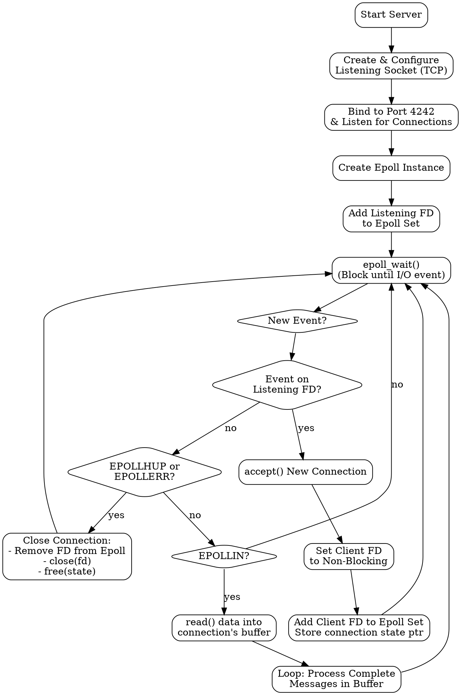
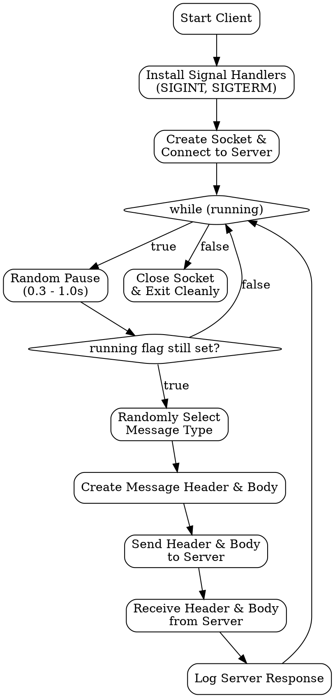

Of course. Here are the C programs for a client and server, along with a `Makefile`, Graphviz flow diagrams, and a detailed explanation, all adhering to the specified requirements.

### Explanation for an Experienced Engineer

This submission provides a robust client-server application demonstrating a single-threaded, asynchronous I/O model using `epoll` on Linux. The design is suitable for production environments where handling numerous concurrent, long-lived connections with low resource overhead is critical.

**Architectural Highlights:**

1.  **Asynchronous I/O with `epoll`**: The server's core is a single thread managing all I/O via `epoll`. This model avoids the high memory and context-switching overhead of thread-per-connection architectures and the complexity of managing thread pools. `epoll` is used in its edge-triggered (`EPOLLET`) mode for the listening socket to prevent "thundering herd" problems, and in its default level-triggered mode for client sockets, simplifying the read/write logic.

2.  **Connection State Management**: To manage client state in a single-threaded model, each connection is represented by a `client_connection_t` struct. This struct contains the file descriptor and, most importantly, a read buffer. A pointer to this struct is associated with its file descriptor using the `epoll_event.data.ptr` field. This provides a direct, O(1) lookup from an event to its corresponding connection state, which is essential for performance.

3.  **Stream-Oriented Read Buffering**: TCP is a stream-based protocol, not a message-based one. A single `read()` call may return a partial message, multiple messages, or one-and-a-half messages. The `handle_client_data` function implements a robust buffering strategy to handle this. It reads available data into a per-connection buffer and then enters a loop, processing as many complete messages as are present in the buffer. Any remaining partial message is left at the beginning of the buffer for the next `read()` call to complete. `memmove` is used to shift this partial data.

4.  **Message Framing**: A custom binary protocol is used for clear message demarcation. It consists of a fixed-size `message_header_t` (containing a message type `enum` and a 32-bit body length) followed by a variable-length, null-terminated string body. The `__attribute__((packed))` directive on the header struct is crucial for cross-platform compatibility (specifically x86_64 and AARCH64), ensuring that the compiler does not introduce architecture-specific padding that would break the protocol.

5.  **Graceful Shutdown**: The client implements signal handlers for `SIGINT` and `SIGTERM`. A `volatile sig_atomic_t` flag is used to safely communicate the shutdown request from the signal handler to the main application loop, ensuring a clean exit. This is the only correct way to handle signals in this manner, as most functions are not async-signal-safe.

6.  **Production-Ready Code**:
    *   **Compiler Flags**: The `Makefile` sets strict compiler flags (`-Wall -Wextra -Wpedantic`) to catch potential issues, enforces the C17 standard, and enables optimizations (`-O2`).
    *   **Feature Test Macros**: `_POSIX_C_SOURCE` and `_DEFAULT_SOURCE` are defined in the `Makefile` to enable POSIX.1-2008 and other useful non-standard features (like `epoll`) without polluting the C source files.
    *   **Fixed-Width Types**: `stdint.h` and `inttypes.h` are used throughout to guarantee integer sizes and formatting, eliminating ambiguity across different architectures.
    *   **Error Handling**: All system and library calls are checked for errors. Errors are logged verbosely with `errno` context.
    *   **Assertions**: `assert()` is used to validate function preconditions (e.g., non-NULL pointers, valid file descriptors), which helps catch bugs during development and testing. These can be disabled in a final release build by defining `NDEBUG`.

---

### 1. Shared Header File (`message.h`)

This file defines the common message structure used by both the client and server.

```c
// message.h
#ifndef MESSAGE_H
#define MESSAGE_H

#include <stdint.h>

// Define the types of messages that can be exchanged.
typedef enum {
    MSG_ECHO,
    MSG_REVERSE,
    MSG_TIME,
} message_type_t;

// The fixed-length message header.
// The `__attribute__((packed))` is important to prevent the compiler from
// adding padding between fields, which ensures the struct has the same
// memory layout on different architectures (like x86_64 and AARCH64).
typedef struct __attribute__((packed)) {
    message_type_t type;
    uint32_t length; // Length of the body, INCLUDING the null terminator.
} message_header_t;

#endif // MESSAGE_H
```

---

### 2. Server Program (`server.c`)

```c
// server.c
#define _GNU_SOURCE // For strcasestr
#include <stdio.h>
#include <stdlib.h>
#include <string.h>
#include <unistd.h>
#include <assert.h>
#include <errno.h>
#include <time.h>
#include <sys/epoll.h>
#include <sys/socket.h>
#include <netinet/in.h>
#include <arpa/inet.h>
#include <fcntl.h>
#include "message.h"

// Use a macro for debug logging that can be compiled out.
#ifdef DEBUG_LOG
#define LOG_DEBUG(fmt, ...) fprintf(stderr, "[DEBUG] %s:%d: " fmt "\n", __FILE__, __LINE__, ##__VA_ARGS__)
#else
#define LOG_DEBUG(fmt, ...)
#endif

#define LOG_INFO(fmt, ...) fprintf(stdout, "[INFO] " fmt "\n", ##__VA_ARGS__)
#define LOG_ERROR(fmt, ...) fprintf(stderr, "[ERROR] %s:%d: " fmt " (errno: %s)\n", __FILE__, __LINE__, ##__VA_ARGS__, errno ? strerror(errno) : "None")

#define SERVER_PORT 4242
#define MAX_CONNECTIONS 1024
#define MAX_EVENTS 128
#define READ_BUFFER_SIZE 4096

typedef struct {
    int fd;
    uint8_t read_buffer[READ_BUFFER_SIZE];
    size_t read_pos;
} client_connection_t;


static void reverse_string(char *str) {
    assert(str != NULL);
    size_t len = strlen(str);
    if (len < 2) return;
    char *start = str;
    char *end = str + len - 1;
    while (start < end) {
        char temp = *start;
        *start++ = *end;
        *end-- = temp;
    }
}

static int send_all(int fd, const void *buf, size_t len) {
    assert(fd >= 0);
    assert(buf != NULL);

    const uint8_t *p = buf;
    size_t sent = 0;
    while (sent < len) {
        ssize_t n = write(fd, p + sent, len - sent);
        if (n < 0) {
            if (errno == EAGAIN || errno == EWOULDBLOCK) {
                // Should not happen with blocking sockets for this simple case,
                // but good practice. A real-world server would buffer the write.
                LOG_DEBUG("Write would block on fd %d, retrying later.", fd);
                continue;
            }
            LOG_ERROR("Failed to write to fd %d", fd);
            return -1;
        }
        sent += n;
    }
    return 0;
}


static void process_message(int client_fd, const message_header_t *header, const char *body) {
    assert(client_fd >= 0);
    assert(header != NULL);
    assert(body != NULL);

    LOG_DEBUG("Processing message type %d from fd %d", header->type, client_fd);

    switch (header->type) {
        case MSG_ECHO: {
            // Echo the message back directly
            if (send_all(client_fd, header, sizeof(message_header_t)) != 0 ||
                send_all(client_fd, body, header->length) != 0) {
                LOG_ERROR("Failed to send ECHO response to fd %d", client_fd);
            }
            break;
        }
        case MSG_REVERSE: {
            char reversed_body[header->length];
            strncpy(reversed_body, body, header->length);
            reverse_string(reversed_body);
            if (send_all(client_fd, header, sizeof(message_header_t)) != 0 ||
                send_all(client_fd, reversed_body, header->length) != 0) {
                LOG_ERROR("Failed to send REVERSE response to fd %d", client_fd);
            }
            break;
        }
        case MSG_TIME: {
            char time_str[128];
            time_t now = time(NULL);
            struct tm *t = gmtime(&now);
            strftime(time_str, sizeof(time_str), "%Y-%m-%dT%H:%M:%SZ", t);
            
            message_header_t response_header;
            response_header.type = MSG_TIME;
            response_header.length = strlen(time_str) + 1;

            if (send_all(client_fd, &response_header, sizeof(message_header_t)) != 0 ||
                send_all(client_fd, time_str, response_header.length) != 0) {
                LOG_ERROR("Failed to send TIME response to fd %d", client_fd);
            }
            break;
        }
        default:
            LOG_ERROR("Unknown message type %d from fd %d", header->type, client_fd);
            break;
    }
}

static void close_connection(int epoll_fd, client_connection_t *conn) {
    assert(epoll_fd >= 0);
    assert(conn != NULL);

    LOG_DEBUG("Closing connection for fd %d", conn->fd);
    epoll_ctl(epoll_fd, EPOLL_CTL_DEL, conn->fd, NULL);
    close(conn->fd);
    free(conn);
}

static void handle_client_data(int epoll_fd, client_connection_t *conn) {
    assert(epoll_fd >= 0);
    assert(conn != NULL);

    ssize_t bytes_read = read(conn->fd, conn->read_buffer + conn->read_pos, READ_BUFFER_SIZE - conn->read_pos);

    if (bytes_read <= 0) {
        if (bytes_read < 0 && (errno == EAGAIN || errno == EWOULDBLOCK)) {
            // No more data to read for now.
            return;
        }
        // Connection closed by peer or error
        if (bytes_read == 0) LOG_INFO("Client fd %d disconnected.", conn->fd);
        else LOG_ERROR("Read error on fd %d", conn->fd);
        close_connection(epoll_fd, conn);
        return;
    }

    conn->read_pos += bytes_read;
    LOG_DEBUG("Read %zd bytes from fd %d. Total in buffer: %zu", bytes_read, conn->fd, conn->read_pos);

    // Process all complete messages in the buffer
    while (conn->read_pos >= sizeof(message_header_t)) {
        message_header_t *header = (message_header_t*)conn->read_buffer;

        if (header->length > READ_BUFFER_SIZE - sizeof(message_header_t)) {
             LOG_ERROR("Client fd %d sent message too large. Closing.", conn->fd);
             close_connection(epoll_fd, conn);
             return;
        }

        if (conn->read_pos >= sizeof(message_header_t) + header->length) {
            // We have a full message
            char *body = (char*)(conn->read_buffer + sizeof(message_header_t));
            
            // Ensure body is null-terminated as expected
            if (body[header->length - 1] != '\0') {
                LOG_ERROR("Message body from fd %d is not null-terminated. Closing.", conn->fd);
                close_connection(epoll_fd, conn);
                return;
            }

            process_message(conn->fd, header, body);

            // Move remaining data to the front of the buffer
            size_t consumed_len = sizeof(message_header_t) + header->length;
            conn->read_pos -= consumed_len;
            memmove(conn->read_buffer, conn->read_buffer + consumed_len, conn->read_pos);
            LOG_DEBUG("Processed one message, %zu bytes remain in buffer for fd %d", conn->read_pos, conn->fd);
        } else {
            // Not enough data for the full body yet, break and wait for more
            break;
        }
    }
}


static void add_client_to_epoll(int epoll_fd, int client_fd) {
    assert(epoll_fd >= 0);
    assert(client_fd >= 0);

    client_connection_t *conn = malloc(sizeof(client_connection_t));
    if (!conn) {
        LOG_ERROR("Failed to allocate memory for new connection");
        close(client_fd);
        return;
    }
    conn->fd = client_fd;
    conn->read_pos = 0;

    struct epoll_event event;
    event.events = EPOLLIN | EPOLLHUP | EPOLLRDHUP;
    event.data.ptr = conn;

    if (epoll_ctl(epoll_fd, EPOLL_CTL_ADD, client_fd, &event) == -1) {
        LOG_ERROR("Failed to add client fd %d to epoll", client_fd);
        free(conn);
        close(client_fd);
    } else {
        LOG_INFO("New connection accepted on fd %d", client_fd);
    }
}


static void set_non_blocking(int fd) {
    assert(fd >= 0);
    int flags = fcntl(fd, F_GETFL, 0);
    if (flags == -1) {
        LOG_ERROR("fcntl F_GETFL failed for fd %d", fd);
        return;
    }
    if (fcntl(fd, F_SETFL, flags | O_NONBLOCK) == -1) {
        LOG_ERROR("fcntl F_SETFL failed for fd %d", fd);
    }
}

int main(void) {
    LOG_INFO("Hello from the server");

    int listen_fd = socket(AF_INET, SOCK_STREAM, 0);
    if (listen_fd < 0) {
        LOG_ERROR("Failed to create listening socket");
        return EXIT_FAILURE;
    }

    int opt = 1;
    if (setsockopt(listen_fd, SOL_SOCKET, SO_REUSEADDR, &opt, sizeof(opt)) < 0) {
        LOG_ERROR("Failed to set SO_REUSEADDR");
        close(listen_fd);
        return EXIT_FAILURE;
    }

    struct sockaddr_in server_addr = {0};
    server_addr.sin_family = AF_INET;
    server_addr.sin_addr.s_addr = htonl(INADDR_ANY); // Listen on all interfaces
    server_addr.sin_port = htons(SERVER_PORT);

    if (bind(listen_fd, (struct sockaddr *)&server_addr, sizeof(server_addr)) < 0) {
        LOG_ERROR("Failed to bind to port %d", SERVER_PORT);
        close(listen_fd);
        return EXIT_FAILURE;
    }

    if (listen(listen_fd, MAX_CONNECTIONS) < 0) {
        LOG_ERROR("Failed to listen on socket");
        close(listen_fd);
        return EXIT_FAILURE;
    }
    LOG_INFO("Server listening on port %d", SERVER_PORT);

    int epoll_fd = epoll_create1(0);
    if (epoll_fd < 0) {
        LOG_ERROR("Failed to create epoll instance");
        close(listen_fd);
        return EXIT_FAILURE;
    }

    struct epoll_event event;
    event.events = EPOLLIN;
    event.data.fd = listen_fd;
    if (epoll_ctl(epoll_fd, EPOLL_CTL_ADD, listen_fd, &event) < 0) {
        LOG_ERROR("Failed to add listening socket to epoll");
        close(listen_fd);
        close(epoll_fd);
        return EXIT_FAILURE;
    }

    struct epoll_event events[MAX_EVENTS];

    while (1) {
        int n_events = epoll_wait(epoll_fd, events, MAX_EVENTS, -1);
        if (n_events < 0) {
            if (errno == EINTR) continue; // Interrupted by signal, safe to continue
            LOG_ERROR("epoll_wait failed");
            break;
        }

        for (int i = 0; i < n_events; i++) {
            if (events[i].data.fd == listen_fd) {
                // New connection
                struct sockaddr_in client_addr;
                socklen_t client_len = sizeof(client_addr);
                int client_fd = accept(listen_fd, (struct sockaddr *)&client_addr, &client_len);
                if (client_fd < 0) {
                    LOG_ERROR("Failed to accept new connection");
                    continue;
                }
                set_non_blocking(client_fd);
                add_client_to_epoll(epoll_fd, client_fd);
            } else {
                client_connection_t *conn = (client_connection_t*)events[i].data.ptr;
                // Handle EPOLLHUP or errors on the connection
                if (events[i].events & (EPOLLHUP | EPOLLRDHUP | EPOLLERR)) {
                    LOG_INFO("Client fd %d hung up or error occurred.", conn->fd);
                    close_connection(epoll_fd, conn);
                    continue;
                }
                // Handle incoming data
                if (events[i].events & EPOLLIN) {
                    handle_client_data(epoll_fd, conn);
                }
            }
        }
    }

    close(listen_fd);
    close(epoll_fd);
    LOG_INFO("Server shutting down.");
    return EXIT_SUCCESS;
}
```

---

### 3. Client Program (`client.c`)

```c
// client.c
#include <stdio.h>
#include <stdlib.h>
#include <string.h>
#include <unistd.h>
#include <assert.h>
#include <errno.h>
#include <time.h>
#include <signal.h>
#include <sys/socket.h>
#include <netinet/in.h>
#include <arpa/inet.h>
#include <inttypes.h>
#include "message.h"

// Use a macro for debug logging that can be compiled out.
#ifdef DEBUG_LOG
#define LOG_DEBUG(fmt, ...) fprintf(stderr, "[DEBUG] %s:%d: " fmt "\n", __FILE__, __LINE__, ##__VA_ARGS__)
#else
#define LOG_DEBUG(fmt, ...)
#endif

#define LOG_INFO(fmt, ...) fprintf(stdout, "[INFO] " fmt "\n", ##__VA_ARGS__)
#define LOG_ERROR(fmt, ...) fprintf(stderr, "[ERROR] %s:%d: " fmt " (errno: %s)\n", __FILE__, __LINE__, ##__VA_ARGS__, errno ? strerror(errno) : "None")

#define SERVER_IP "127.0.0.1"
#define SERVER_PORT 4242
#define RECV_BUFFER_SIZE 4096

// Global flag for signal handling
static volatile sig_atomic_t running = 1;

void handle_signal(int signal) {
    if (signal == SIGINT || signal == SIGTERM) {
        running = 0;
        // Writing to stdout in a signal handler is not technically safe,
        // but it's acceptable for this informational purpose. A better way
        // would be to write to a pipe or use a self-pipe trick.
        write(STDOUT_FILENO, "\nCaught signal, shutting down...\n", 32);
    }
}

static int send_all(int fd, const void *buf, size_t len) {
    assert(fd >= 0);
    assert(buf != NULL);
    const uint8_t *p = buf;
    size_t sent = 0;
    while (sent < len) {
        ssize_t n = write(fd, p + sent, len - sent);
        if (n < 0) {
            LOG_ERROR("Failed to write to socket");
            return -1;
        }
        sent += n;
    }
    return 0;
}


static int receive_all(int fd, void *buf, size_t len) {
    assert(fd >= 0);
    assert(buf != NULL);
    uint8_t *p = buf;
    size_t received = 0;
    while (received < len) {
        ssize_t n = read(fd, p + received, len - received);
        if (n <= 0) {
             if (n < 0) LOG_ERROR("Failed to read from socket");
             else LOG_INFO("Server closed connection");
             return -1;
        }
        received += n;
    }
    return 0;
}


int main(void) {
    // Seed the random number generator
    srand(time(NULL));

    // Setup signal handlers for graceful shutdown
    struct sigaction sa;
    sa.sa_handler = handle_signal;
    sigemptyset(&sa.sa_mask);
    sa.sa_flags = 0; // Don't restart syscalls
    sigaction(SIGINT, &sa, NULL);
    sigaction(SIGTERM, &sa, NULL);

    int sock_fd = socket(AF_INET, SOCK_STREAM, 0);
    if (sock_fd < 0) {
        LOG_ERROR("Failed to create socket");
        return EXIT_FAILURE;
    }

    struct sockaddr_in server_addr = {0};
    server_addr.sin_family = AF_INET;
    server_addr.sin_port = htons(SERVER_PORT);
    if (inet_pton(AF_INET, SERVER_IP, &server_addr.sin_addr) <= 0) {
        LOG_ERROR("Invalid server IP address");
        close(sock_fd);
        return EXIT_FAILURE;
    }

    LOG_INFO("Connecting to server at %s:%d...", SERVER_IP, SERVER_PORT);
    if (connect(sock_fd, (struct sockaddr *)&server_addr, sizeof(server_addr)) < 0) {
        LOG_ERROR("Failed to connect to server");
        close(sock_fd);
        return EXIT_FAILURE;
    }
    LOG_INFO("Connected.");

    const char *test_messages[] = {
        "The quick brown fox jumps over the lazy dog.",
        "Hello C17 world!",
        "Testing network protocols."
    };
    const int num_test_messages = sizeof(test_messages) / sizeof(test_messages[0]);

    while (running) {
        // 1. Pause randomly between 0.3 and 1.0 seconds
        long sleep_usec = 300000 + (rand() % 700001);
        LOG_DEBUG("Sleeping for %ld microseconds", sleep_usec);
        usleep(sleep_usec);

        if (!running) break;

        // 2. Randomly select and create a message
        message_header_t header;
        header.type = rand() % 3; // Corresponds to MSG_ECHO, MSG_REVERSE, MSG_TIME
        
        char body_buffer[1024];
        
        if (header.type == MSG_ECHO || header.type == MSG_REVERSE) {
            const char* msg_text = test_messages[rand() % num_test_messages];
            strcpy(body_buffer, msg_text);
            header.length = strlen(body_buffer) + 1;
        } else { // MSG_TIME
            strcpy(body_buffer, "time_request"); // Body is ignored by server
            header.length = strlen(body_buffer) + 1;
        }
        
        LOG_INFO("Sending message type %d with body: \"%s\"", header.type, header.type != MSG_TIME ? body_buffer : "(none)");
        
        // 3. Send message to server
        if (send_all(sock_fd, &header, sizeof(header)) != 0) {
            break; // Connection failed
        }
        if (send_all(sock_fd, body_buffer, header.length) != 0) {
            break; // Connection failed
        }

        // 4. Wait for and read response
        message_header_t response_header;
        if (receive_all(sock_fd, &response_header, sizeof(response_header)) != 0) {
            break; // Connection failed
        }
        
        if (response_header.length > RECV_BUFFER_SIZE) {
            LOG_ERROR("Server response too large (%" PRIu32 " bytes)", response_header.length);
            break;
        }

        char response_body[RECV_BUFFER_SIZE];
        if (receive_all(sock_fd, response_body, response_header.length) != 0) {
            break; // Connection failed
        }

        LOG_INFO("Received response type %d, length %" PRIu32 ", body: \"%s\"",
                 response_header.type, response_header.length, response_body);
        LOG_INFO("--------------------------------------------------");
    }

    close(sock_fd);
    LOG_INFO("Connection closed. Exiting.");
    return EXIT_SUCCESS;
}
```

---

### 4. Makefile

This `Makefile` compiles both the client and server with the specified flags.

```makefile
# Makefile

# Compiler and flags
CC = gcc
# CFLAGS for C17 standard, strict warnings, optimization, and debug symbols.
# Define feature test macros here, not in the source code.
# -DDEBUG_LOG enables the debug logging macros. Remove it for a quieter build.
CFLAGS = -std=c17 -Wall -Wextra -Wpedantic -O2 -g \
         -D_POSIX_C_SOURCE=200809L -D_DEFAULT_SOURCE -DDEBUG_LOG

# Linker flags (if any)
LDFLAGS =

# Source files
SERVER_SRC = server.c
CLIENT_SRC = client.c

# Object files
SERVER_OBJ = $(SERVER_SRC:.c=.o)
CLIENT_OBJ = $(CLIENT_SRC:.c=.o)

# Executable names
SERVER_EXEC = server
CLIENT_EXEC = client

# Default target
all: $(SERVER_EXEC) $(CLIENT_EXEC)

# Rule to build the server executable
$(SERVER_EXEC): $(SERVER_OBJ)
	$(CC) $(CFLAGS) -o $@ $^ $(LDFLAGS)

# Rule to build the client executable
$(CLIENT_EXEC): $(CLIENT_OBJ)
	$(CC) $(CFLAGS) -o $@ $^ $(LDFLAGS)

# Generic rule for compiling .c to .o
%.o: %.c message.h
	$(CC) $(CFLAGS) -c -o $@ $<

# Clean up build artifacts
clean:
	rm -f $(SERVER_EXEC) $(CLIENT_EXEC) $(SERVER_OBJ) $(CLIENT_OBJ)

.PHONY: all clean

```

---

### 5. Graphviz Flow Diagrams

#### Server Logic (`server.dot`)

This file describes the logical flow of the `server` program.



#### Client Logic (`client.dot`)
This file describes the logical flow of the `client` program.



#### How to Generate PNG from `.dot` files

You will need the `graphviz` package installed. On Debian/Ubuntu, you can install it with `sudo apt-get install graphviz`.

Then, run the following command for each file:

```sh
dot -Tpng server.dot -o server_flow.png
dot -Tpng client.dot -o client_flow.png
```

This will produce `server_flow.png` and `client_flow.png`, visualizing the program logic.

### How to Compile and Run

1.  Save the files as `message.h`, `server.c`, `client.c`, and `Makefile` in the same directory.
2.  Open a terminal in that directory.
3.  Run `make` to compile both programs:
    ```sh
    make
    ```
4.  In one terminal, start the server:
    ```sh
    ./server
    ```
5.  In another terminal, start the client:
    ```sh
    ./client
    ```

The client will start sending random messages to the server, and you will see the logs in both terminals. To stop the client gracefully, press `Ctrl+C`. The server will continue running until you stop it with `Ctrl+C`.
