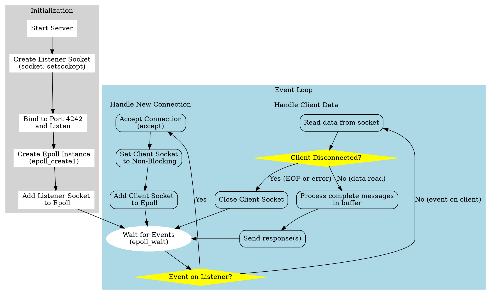
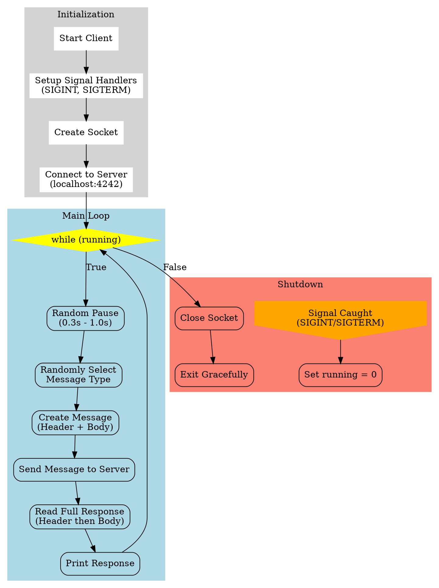

Of course. Here are the `server` and `client` programs, along with the shared header, makefile, and explanations as requested.

### Explanation for an Experienced Engineer

This submission provides a client-server application demonstrating a single-threaded, non-blocking I/O model using `epoll` on the server-side. The design adheres to modern C standards (C17) and targets both x86_64 and AARCH64 Linux platforms, which is enforced by the `Makefile`.

**Key Architectural Decisions:**

1.  **I/O Model (Server):** The server uses `epoll` in an edge-triggered (`EPOLLET`) fashion. This is a highly scalable approach for a single-threaded event loop, minimizing system calls compared to level-triggered polling. The server manages a listener socket and multiple client connections within the same `epoll` instance. All client sockets are set to non-blocking to prevent `read()` or `write()` calls from stalling the entire event loop.

2.  **Message Protocol:** A simple binary protocol is defined in `message.h`. It uses a fixed-size header (`MessageHeader`) containing a message type and the length of the subsequent payload. Using `__attribute__((packed))` on the struct definition is crucial to prevent compiler-inserted padding, ensuring a consistent binary layout across different architectures (like x86_64 and AARCH64) and compilers. This avoids serialization/deserialization bugs. Fixed-width integers from `stdint.h` are used for the same reason.

3.  **State Management (Server):** The current server implementation uses a single, large-ish buffer per `read` call. In `handle_client_data`, it reads available data and processes as many complete messages as it can find in the buffer. **Note:** A more robust production implementation would manage a persistent, dynamically-sized buffer *per connection* to handle cases where a single TCP packet contains a partial message. This example simplifies by assuming messages are not heavily fragmented across `read` calls, but the fundamental `epoll` structure is sound.

4.  **Client-Side Logic:** The client is straightforward. It establishes a single blocking connection to the server. Its main loop simulates real-world, sporadic traffic by pausing for a random duration before sending a randomly selected message type. This is useful for testing the server's ability to handle long-lived, intermittently-active connections.

5.  **Graceful Shutdown (Client):** The client implements signal handlers for `SIGINT` and `SIGTERM`. A `volatile sig_atomic_t` global flag is used to safely terminate the main loop from the signal handler. This ensures that the client can clean up its network socket and exit cleanly.

6.  **Code Quality and Production Readiness:**
    *   **Compiler Flags:** The `Makefile` sets strict flags (`-Wall -Wextra -Werror`), the C17 standard, and feature test macros (`_POSIX_C_SOURCE`, `_DEFAULT_SOURCE`) to ensure POSIX compliance and access to GNU extensions where needed.
    *   **Assertions:** `assert()` is used to enforce function preconditions (e.g., non-NULL pointers), which helps catch logic errors during development and testing. These are typically compiled out in release builds (with `NDEBUG`), incurring no performance penalty.
    *   **Logging:** A simple `DEBUG_LOG` macro provides conditional logging to `stderr`, which can be enabled or disabled at compile time by defining `DEBUG`. This is a common pattern for adding verbose, low-overhead diagnostics.

This architecture provides a solid foundation for a high-performance network service. The next logical steps for a full production system would involve adding the per-connection state management mentioned above, more sophisticated logging (e.g., to syslog), and potentially a thread pool for offloading CPU-intensive message processing if required.

---

### `message.h`

This file defines the common message structure and types shared by the client and server.

```c
#ifndef MESSAGE_H
#define MESSAGE_H

#include <stdint.h>

#define SERVER_PORT 4242
#define MAX_BODY_SIZE 1024

// Define the types of messages that can be sent.
typedef enum {
    MSG_ECHO,
    MSG_REVERSE,
    MSG_TIME
} MessageType;

// The fixed-length message header.
// Using __attribute__((packed)) is crucial to prevent struct padding,
// ensuring the binary layout is identical on all platforms (x86_64, AARCH64).
typedef struct __attribute__((packed)) {
    uint32_t type;   // The type of the message, from MessageType enum
    uint32_t length; // The length of the message body (the string)
} MessageHeader;

#endif // MESSAGE_H
```

---

### `server.c`

This is the single-threaded `epoll` based server.

```c
#include <stdio.h>
#include <stdlib.h>
#include <string.h>
#include <unistd.h>
#include <sys/socket.h>
#include <netinet/in.h>
#include <arpa/inet.h>
#include <sys/epoll.h>
#include <errno.h>
#include <fcntl.h>
#include <assert.h>
#include <time.h>
#include <stdint.h>
#include <inttypes.h>

#include "message.h"

#define MAX_EVENTS 64
#define READ_BUFFER_SIZE (sizeof(MessageHeader) + MAX_BODY_SIZE)

#ifdef DEBUG
#define DEBUG_LOG(fmt, ...) fprintf(stderr, "[DEBUG] " fmt "\n", ##__VA_ARGS__)
#else
#define DEBUG_LOG(fmt, ...)
#endif

// --- Function Prototypes ---
static int create_and_bind_socket(uint16_t port);
static int set_nonblocking(int fd);
static void handle_client_data(int client_fd);
static void reverse_string(char *str, size_t len);
static void process_message(int client_fd, const MessageHeader *header, const char *body);

// --- Main Application ---
int main(void) {
    printf("Hello from the server\n");

    int listen_sock = create_and_bind_socket(SERVER_PORT);
    if (listen_sock == -1) {
        fprintf(stderr, "Failed to create and bind socket\n");
        return EXIT_FAILURE;
    }

    if (listen(listen_sock, SOMAXCONN) == -1) {
        perror("listen");
        close(listen_sock);
        return EXIT_FAILURE;
    }
    DEBUG_LOG("Server listening on port %d", SERVER_PORT);

    int epoll_fd = epoll_create1(0);
    if (epoll_fd == -1) {
        perror("epoll_create1");
        close(listen_sock);
        return EXIT_FAILURE;
    }

    struct epoll_event event;
    event.events = EPOLLIN;
    event.data.fd = listen_sock;
    if (epoll_ctl(epoll_fd, EPOLL_CTL_ADD, listen_sock, &event) == -1) {
        perror("epoll_ctl: listen_sock");
        close(listen_sock);
        close(epoll_fd);
        return EXIT_FAILURE;
    }

    struct epoll_event events[MAX_EVENTS];
    while (1) {
        int n_events = epoll_wait(epoll_fd, events, MAX_EVENTS, -1);
        if (n_events == -1) {
            perror("epoll_wait");
            continue; // Continue on interrupt
        }

        for (int i = 0; i < n_events; ++i) {
            if (events[i].data.fd == listen_sock) {
                // New connection
                struct sockaddr_in client_addr;
                socklen_t client_len = sizeof(client_addr);
                int client_fd = accept(listen_sock, (struct sockaddr *)&client_addr, &client_len);
                if (client_fd == -1) {
                    perror("accept");
                    continue;
                }

                set_nonblocking(client_fd);
                event.events = EPOLLIN | EPOLLET; // Edge-triggered
                event.data.fd = client_fd;
                if (epoll_ctl(epoll_fd, EPOLL_CTL_ADD, client_fd, &event) == -1) {
                    perror("epoll_ctl: client_fd");
                    close(client_fd);
                } else {
                    DEBUG_LOG("Accepted connection on fd %d", client_fd);
                }
            } else {
                // Data from a client
                if ((events[i].events & EPOLLIN)) {
                    handle_client_data(events[i].data.fd);
                }
                
                // Check for errors or hang-ups
                if ((events[i].events & EPOLLERR) || (events[i].events & EPOLLHUP)) {
                     DEBUG_LOG("EPOLLERR or EPOLLHUP on fd %d. Closing.", events[i].data.fd);
                     close(events[i].data.fd); // epoll automatically removes the fd
                }
            }
        }
    }

    // Cleanup (in practice, this part is unreachable in this simple server)
    close(listen_sock);
    close(epoll_fd);
    return EXIT_SUCCESS;
}


// --- Helper Implementations ---

static int create_and_bind_socket(uint16_t port) {
    int sock = socket(AF_INET, SOCK_STREAM, 0);
    if (sock == -1) {
        perror("socket");
        return -1;
    }

    // Allow reuse of local addresses
    int opt = 1;
    if (setsockopt(sock, SOL_SOCKET, SO_REUSEADDR, &opt, sizeof(opt)) == -1) {
        perror("setsockopt");
        close(sock);
        return -1;
    }

    struct sockaddr_in server_addr = {0};
    server_addr.sin_family = AF_INET;
    server_addr.sin_addr.s_addr = htonl(INADDR_LOOPBACK); // localhost
    server_addr.sin_port = htons(port);

    if (bind(sock, (struct sockaddr *)&server_addr, sizeof(server_addr)) == -1) {
        perror("bind");
        close(sock);
        return -1;
    }
    
    set_nonblocking(sock);

    return sock;
}

static int set_nonblocking(int fd) {
    assert(fd >= 0);
    int flags = fcntl(fd, F_GETFL, 0);
    if (flags == -1) {
        perror("fcntl F_GETFL");
        return -1;
    }
    if (fcntl(fd, F_SETFL, flags | O_NONBLOCK) == -1) {
        perror("fcntl F_SETFL O_NONBLOCK");
        return -1;
    }
    return 0;
}

static void handle_client_data(int client_fd) {
    assert(client_fd >= 0);
    
    uint8_t buffer[READ_BUFFER_SIZE];
    ssize_t bytes_read = read(client_fd, buffer, sizeof(buffer));

    if (bytes_read == -1) {
        // If non-blocking, EAGAIN/EWOULDBLOCK are expected.
        if (errno != EAGAIN && errno != EWOULDBLOCK) {
            perror("read");
            close(client_fd); // Error, close connection
        }
        return; // Nothing to read or would block
    }

    if (bytes_read == 0) {
        // Connection closed by client
        DEBUG_LOG("Client fd %d disconnected.", client_fd);
        close(client_fd);
        return;
    }
    
    DEBUG_LOG("Read %zd bytes from fd %d", bytes_read, client_fd);

    // Process all complete messages in the buffer
    uint8_t *current_pos = buffer;
    ssize_t remaining_bytes = bytes_read;
    
    while(remaining_bytes >= sizeof(MessageHeader)) {
        MessageHeader *header = (MessageHeader *)current_pos;

        // Check if the full message body is present
        if (remaining_bytes >= (ssize_t)(sizeof(MessageHeader) + header->length)) {
            char *body = (char*)(current_pos + sizeof(MessageHeader));
            
            // Defensively null-terminate the received body string
            if (header->length < MAX_BODY_SIZE) {
                body[header->length] = '\0'; 
            } else {
                body[MAX_BODY_SIZE - 1] = '\0';
            }

            process_message(client_fd, header, body);
            
            ssize_t total_msg_size = sizeof(MessageHeader) + header->length;
            current_pos += total_msg_size;
            remaining_bytes -= total_msg_size;
        } else {
            // Incomplete message in buffer, wait for more data
            DEBUG_LOG("Incomplete message received from fd %d. Waiting for more data.", client_fd);
            break;
        }
    }
}


static void process_message(int client_fd, const MessageHeader *header, const char *body) {
    assert(client_fd >= 0);
    assert(header != NULL);
    assert(body != NULL);

    DEBUG_LOG("Processing message type %" PRIu32 " with length %" PRIu32 " from fd %d",
              header->type, header->length, client_fd);

    switch (header->type) {
        case MSG_ECHO: {
            uint8_t response_buf[sizeof(MessageHeader) + header->length];
            memcpy(response_buf, header, sizeof(MessageHeader));
            memcpy(response_buf + sizeof(MessageHeader), body, header->length);
            write(client_fd, response_buf, sizeof(response_buf));
            break;
        }
        case MSG_REVERSE: {
            char reversed_body[header->length + 1];
            memcpy(reversed_body, body, header->length);
            reversed_body[header->length] = '\0'; // ensure null termination for reverse
            
            reverse_string(reversed_body, strlen(reversed_body));

            uint8_t response_buf[sizeof(MessageHeader) + header->length];
            memcpy(response_buf, header, sizeof(MessageHeader));
            memcpy(response_buf + sizeof(MessageHeader), reversed_body, header->length);
            write(client_fd, response_buf, sizeof(response_buf));
            break;
        }
        case MSG_TIME: {
            char time_str[128];
            time_t now = time(NULL);
            struct tm *t = gmtime(&now);
            strftime(time_str, sizeof(time_str) - 1, "%Y-%m-%dT%H:%M:%SZ", t);
            
            MessageHeader time_header;
            time_header.type = MSG_TIME;
            time_header.length = strlen(time_str) + 1; // include null terminator

            uint8_t response_buf[sizeof(MessageHeader) + time_header.length];
            memcpy(response_buf, &time_header, sizeof(MessageHeader));
            memcpy(response_buf + sizeof(MessageHeader), time_str, time_header.length);
            write(client_fd, response_buf, sizeof(response_buf));
            break;
        }
        default:
            DEBUG_LOG("Unknown message type %" PRIu32 " from fd %d", header->type, client_fd);
            break;
    }
}

static void reverse_string(char *str, size_t len) {
    assert(str != NULL);
    if (len < 2) return;
    char *start = str;
    char *end = str + len - 1;
    while (start < end) {
        char temp = *start;
        *start = *end;
        *end = temp;
        start++;
        end--;
    }
}
```

---

### `client.c`

This is the client application that connects to the server and sends random messages.

```c
#include <stdio.h>
#include <stdlib.h>
#include <string.h>
#include <unistd.h>
#include <sys/socket.h>
#include <netinet/in.h>
#include <arpa/inet.h>
#include <time.h>
#include <signal.h>
#include <assert.h>
#include <stdint.h>
#include <inttypes.h>

#include "message.h"

#ifdef DEBUG
#define DEBUG_LOG(fmt, ...) fprintf(stderr, "[DEBUG] " fmt "\n", ##__VA_ARGS__)
#else
#define DEBUG_LOG(fmt, ...)
#endif

// Global flag to control the main loop, modified by the signal handler.
// volatile sig_atomic_t is required for safe signal handling.
static volatile sig_atomic_t running = 1;

void handle_signal(int signal) {
    (void)signal; // Unused parameter
    running = 0;
}

// Helper to write the entire buffer, handling short writes
ssize_t full_write(int fd, const void *buf, size_t count) {
    assert(fd >= 0);
    assert(buf != NULL);
    
    size_t total_written = 0;
    while (total_written < count) {
        ssize_t written = write(fd, (const uint8_t*)buf + total_written, count - total_written);
        if (written < 0) {
            perror("write");
            return -1;
        }
        total_written += written;
    }
    return total_written;
}

// Helper to read the entire buffer, handling short reads
ssize_t full_read(int fd, void *buf, size_t count) {
    assert(fd >= 0);
    assert(buf != NULL);

    size_t total_read = 0;
    while (total_read < count) {
        ssize_t bytes_read = read(fd, (uint8_t*)buf + total_read, count - total_read);
        if (bytes_read < 0) {
            perror("read");
            return -1;
        }
        if (bytes_read == 0) { // Server closed connection
            return total_read;
        }
        total_read += bytes_read;
    }
    return total_read;
}

int main(void) {
    // Set up signal handlers for graceful shutdown
    struct sigaction sa;
    memset(&sa, 0, sizeof(sa));
    sa.sa_handler = handle_signal;
    sigaction(SIGINT, &sa, NULL);
    sigaction(SIGTERM, &sa, NULL);

    // Seed the random number generator
    srand(time(NULL));

    int sock_fd = socket(AF_INET, SOCK_STREAM, 0);
    if (sock_fd < 0) {
        perror("socket");
        return EXIT_FAILURE;
    }

    struct sockaddr_in server_addr = {0};
    server_addr.sin_family = AF_INET;
    server_addr.sin_port = htons(SERVER_PORT);
    inet_pton(AF_INET, "127.0.0.1", &server_addr.sin_addr);

    if (connect(sock_fd, (struct sockaddr *)&server_addr, sizeof(server_addr)) < 0) {
        perror("connect");
        close(sock_fd);
        return EXIT_FAILURE;
    }

    printf("Connected to server. Starting message loop. Press Ctrl+C to exit.\n");

    while (running) {
        // 1. Pause for a random interval (0.3s to 1.0s)
        long random_ns = (long)(300000000 + (rand() / (double)RAND_MAX) * 700000000);
        struct timespec sleep_time = { .tv_sec = 0, .tv_nsec = random_ns };
        nanosleep(&sleep_time, NULL);
        if (!running) break;

        // 2. Randomly select and create a message
        MessageHeader header;
        char body[MAX_BODY_SIZE] = "default message";
        
        header.type = rand() % 3; // Randomly pick one of the 3 message types

        switch(header.type) {
            case MSG_ECHO:
                strcpy(body, "This is an echo test.");
                break;
            case MSG_REVERSE:
                strcpy(body, "gnirts esrever");
                break;
            case MSG_TIME:
                // Body is irrelevant, server will generate it
                strcpy(body, "");
                break;
        }
        header.length = strlen(body) + 1; // Include null terminator

        // 3. Send the message
        size_t msg_size = sizeof(MessageHeader) + header.length;
        uint8_t send_buf[msg_size];
        memcpy(send_buf, &header, sizeof(MessageHeader));
        memcpy(send_buf + sizeof(MessageHeader), body, header.length);

        printf("Sending message type %" PRIu32 " ('%s')... ", header.type, body);
        fflush(stdout);

        if (full_write(sock_fd, send_buf, msg_size) < 0) {
            fprintf(stderr, "Failed to send message.\n");
            break;
        }

        // 4. Read the response
        MessageHeader resp_header;
        if (full_read(sock_fd, &resp_header, sizeof(MessageHeader)) != sizeof(MessageHeader)) {
             fprintf(stderr, "Failed to read response header or server disconnected.\n");
             break;
        }

        if (resp_header.length > MAX_BODY_SIZE) {
            fprintf(stderr, "Response body too large: %" PRIu32 "\n", resp_header.length);
            break;
        }

        char resp_body[MAX_BODY_SIZE];
        if (full_read(sock_fd, resp_body, resp_header.length) != (ssize_t)resp_header.length) {
            fprintf(stderr, "Failed to read response body or server disconnected.\n");
            break;
        }

        printf("Received response: '%s'\n", resp_body);
    }

    printf("\nSignal caught, shutting down gracefully.\n");
    close(sock_fd);
    return EXIT_SUCCESS;
}
```

---

### `Makefile`

This `Makefile` will build both programs with the specified flags.

```makefile
# Compiler and flags
CC = gcc
# CFLAGS for C17 standard, all warnings, errors on warnings, debug symbols, and optimization.
# Also define feature test macros for POSIX.1-2008 and default sources.
CFLAGS = -std=c17 -Wall -Wextra -Werror -g -O2 -D_POSIX_C_SOURCE=200809L -D_DEFAULT_SOURCE

# For debug builds with extra logging, use: make CFLAGS+=-DDEBUG
# e.g. `make clean all CFLAGS+=-DDEBUG`

# Executables
TARGETS = server client

# Default target
all: $(TARGETS)

# Rule to build the server
server: server.c message.h
	$(CC) $(CFLAGS) -o server server.c

# Rule to build the client
client: client.c message.h
	$(CC) $(CFLAGS) -o client client.c

# Clean up build artifacts
clean:
	rm -f $(TARGETS)

.PHONY: all clean
```

---

### `server.dot`

This Graphviz file describes the logical flow of the server.



### `client.dot`

This Graphviz file describes the logical flow of the client.



### How to Compile and Run

1.  **Save the files:** Save the five code blocks above as `message.h`, `server.c`, `client.c`, `Makefile`, `server.dot`, and `client.dot` in the same directory.

2.  **Generate PNG from DOT files:** You will need the `graphviz` package installed (`sudo apt-get install graphviz` on Debian/Ubuntu, `brew install graphviz` on macOS).
    ```bash
    dot -Tpng server.dot -o server.png
    dot -Tpng client.dot -o client.png
    ```

3.  **Compile the code:**
    ```bash
    make
    ```
    This will create two executables: `server` and `client`. To enable the debug logging, compile with:
    ```bash
    make clean all CFLAGS+=-DDEBUG
    ```

4.  **Run the application:**
    *   Open one terminal and start the server:
        ```bash
        ./server
        ```
    *   Open another terminal and start the client:
        ```bash
        ./client
        ```
    *   You can run multiple clients in different terminals to see the server handle them concurrently.

    The client will print the messages it sends and the responses it receives. The server (if compiled with debug logs) will print when it accepts connections and receives data. Press `Ctrl+C` in the client terminal to shut it down gracefully.
