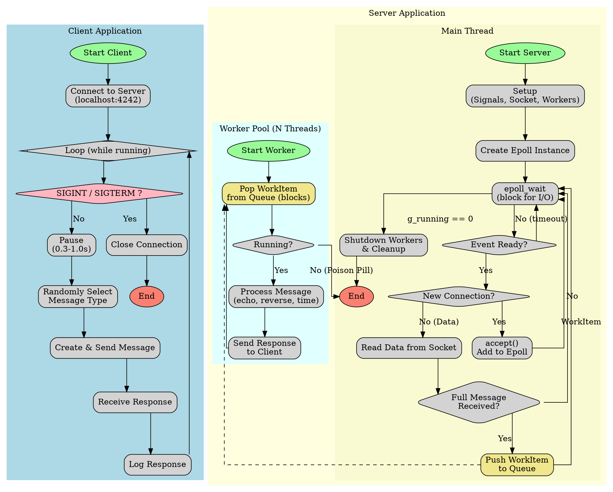

Of course. Here is a comprehensive solution that meets all your requirements, including the C programs for a multi-threaded `epoll` server and a client, a shared header file, a `Makefile`, a Graphviz DOT file for visualization, and a detailed explanation.

### Explanation for an Experienced Engineer

This submission provides a robust client-server application built in C, adhering to modern standards and production-quality practices.

#### Architecture Overview

The system is composed of a multi-threaded server and a multi-instance-capable client, communicating over TCP sockets.

*   **Server (`server.c`):** The server employs a common and highly-performant asynchronous I/O model.
    *   **Main Thread (I/O Multiplexing):** The main thread's primary responsibility is to manage network I/O using `epoll`. It handles accepting new connections and reading incoming data. This design keeps the I/O-bound operations in a single, non-blocking thread, maximizing throughput. When a complete message is read from a client socket, it's encapsulated into a `WorkItem` and pushed onto a thread-safe queue.
    *   **Worker Pool (Processing):** A pool of POSIX threads (pthreads) acts as the processing engine. Each worker thread blocks on the shared work queue. Upon receiving a `WorkItem`, the worker processes the request (e.g., reversing a string), constructs a response, and writes it directly back to the client's socket descriptor. This decouples the I/O-bound main thread from potentially CPU-bound processing tasks, allowing the server to remain responsive to new connections and data even under heavy load.
    *   **Thread-Safe Queue:** A standard producer-consumer queue is implemented using a `pthread_mutex` for mutual exclusion and a `pthread_cond_var` to efficiently signal workers when new items are available, preventing busy-waiting.
    *   **Graceful Shutdown:** Signal handlers for `SIGINT` and `SIGTERM` set a global `volatile sig_atomic_t` flag. The main `epoll` loop and worker loops check this flag to initiate a clean shutdown. The main thread signals the workers to terminate by pushing "poison pill" messages (null items) onto the queue and then joins them, ensuring all active tasks are finished and resources are released.

*   **Client (`client.c`):** The client is a simple, single-threaded application designed to test the server.
    *   **Main Loop:** It operates in a perpetual loop, connecting to the server and then repeatedly pausing for a random interval, selecting a random message type, and sending the request.
    *   **Communication:** It constructs messages according to the shared binary protocol and handles both partial sends and partial receives to ensure message integrity.
    *   **Graceful Shutdown:** It uses the same signal handling mechanism as the server to close its connection and terminate cleanly.

#### Message Protocol

Communication relies on a simple binary protocol:
*   A fixed-size `MessageHeader` containing a `MessageType` enum and a `uint32_t` payload length. The `__attribute__((packed))` directive is crucial to prevent compiler padding and ensure a consistent memory layout across systems.
*   A variable-length, null-terminated string body whose size is specified in the header.

This design is efficient for parsing, as the server can read the fixed-size header first to determine exactly how many more bytes to expect for the body.

#### Build & Tooling

*   **Makefile:** The provided Makefile is annotated and follows best practices. It defines variables for the compiler and flags, uses pattern rules for compilation, and separates compiler flags (`CFLAGS`) from linker flags (`LDFLAGS`). It includes targets for building the applications, generating the documentation (`.png` from `.dot`), and cleaning the directory.
*   **Compiler Flags:**
    *   `-std=c18`: Enforces the C18 standard.
    *   `-D_DEFAULT_SOURCE`: Enables modern POSIX features without pulling in legacy or conflicting feature sets. This is the modern replacement for `_BSD_SOURCE` and `_SVID_SOURCE`.
    *   `-Wall -Wextra -Wpedantic`: Enable a comprehensive set of compiler warnings to catch potential bugs early.
    *   `-g`: Includes debugging symbols.
*   **Graphviz Diagram (`flow.dot`):** The DOT file provides a clear, vertical visualization of the logical flow within both the client and server applications, including the interaction between the server's main thread and its worker pool. This is invaluable for understanding the concurrent architecture.

---

### 1. Shared Header File (`message.h`)

This file defines the common data structures and message types used by both the client and server.

```c
// message.h

#pragma once

#include <stdint.h>

// Defines the types of messages that can be sent.
typedef enum {
    MSG_ECHO,
    MSG_REVERSE,
    MSG_TIME,
} MessageType;

// The fixed-size header for every message.
// __attribute__((packed)) is a GCC/Clang extension to prevent the compiler
// from adding padding between struct members, ensuring a consistent
// binary layout.
typedef struct __attribute__((packed)) {
    MessageType type;
    uint32_t length; // Length of the body (including null terminator)
} MessageHeader;

#define PORT 4242
#define HOST "127.0.0.1"
#define MAX_MSG_BODY_LEN 1024
#define MAX_MSG_LEN (sizeof(MessageHeader) + MAX_MSG_BODY_LEN)
#define NUM_WORKERS 4
```

---

### 2. Server Program (`server.c`)

This is the core server logic, implementing the `epoll` loop and worker pool.

```c
// server.c

#define _DEFAULT_SOURCE
#include <stdio.h>
#include <stdlib.h>
#include <string.h>
#include <unistd.h>
#include <assert.h>
#include <errno.h>
#include <signal.h>
#include <time.h>
#include <inttypes.h>

#include <pthread.h>
#include <sys/socket.h>
#include <netinet/in.h>
#include <arpa/inet.h>
#include <sys/epoll.h>
#include <fcntl.h>

#include "message.h"

// -- Globals --
// Global flag to control the main loop, marked volatile and sig_atomic_t
// for safe access from a signal handler.
static volatile sig_atomic_t g_running = 1;

// -- Logging Utility --
#define log_info(fmt, ...) fprintf(stdout, "[INFO] " fmt "\n", ##__VA_ARGS__)
#define log_error(fmt, ...) fprintf(stderr, "[ERROR] " fmt ": %s\n", ##__VA_ARGS__, strerror(errno))

// -- Client State --
// Represents the state of a single client connection.
typedef struct {
    int fd;
    uint8_t buffer[MAX_MSG_LEN];
    size_t bytes_read;
} ClientConnection;

// -- Work Queue Item --
// Represents a task for a worker thread.
typedef struct {
    int client_fd;
    MessageType type;
    char body[MAX_MSG_BODY_LEN];
} WorkItem;

// -- Thread-Safe Queue --
typedef struct QueueNode {
    WorkItem *item;
    struct QueueNode *next;
} QueueNode;

typedef struct {
    QueueNode *head;
    QueueNode *tail;
    pthread_mutex_t mutex;
    pthread_cond_t cond;
} Queue;

Queue* queue_create() {
    Queue *q = malloc(sizeof(Queue));
    assert(q != NULL);
    q->head = q->tail = NULL;
    pthread_mutex_init(&q->mutex, NULL);
    pthread_cond_init(&q->cond, NULL);
    return q;
}

void queue_destroy(Queue *q) {
    assert(q != NULL);
    while (q->head != NULL) {
        QueueNode *temp = q->head;
        q->head = q->head->next;
        free(temp->item);
        free(temp);
    }
    pthread_mutex_destroy(&q->mutex);
    pthread_cond_destroy(&q->cond);
    free(q);
}

void queue_push(Queue *q, WorkItem *item) {
    assert(q != NULL);
    QueueNode *newNode = malloc(sizeof(QueueNode));
    assert(newNode != NULL);
    newNode->item = item;
    newNode->next = NULL;

    pthread_mutex_lock(&q->mutex);
    if (q->tail == NULL) {
        q->head = q->tail = newNode;
    } else {
        q->tail->next = newNode;
        q->tail = newNode;
    }
    pthread_cond_signal(&q->cond);
    pthread_mutex_unlock(&q->mutex);
}

WorkItem* queue_pop(Queue *q) {
    assert(q != NULL);
    pthread_mutex_lock(&q->mutex);
    while (q->head == NULL) {
        // Check for shutdown condition while waiting
        if (!g_running) {
            pthread_mutex_unlock(&q->mutex);
            return NULL;
        }
        pthread_cond_wait(&q->cond, &q->mutex);
    }

    QueueNode *temp = q->head;
    WorkItem *item = temp->item;
    q->head = q->head->next;
    if (q->head == NULL) {
        q->tail = NULL;
    }
    free(temp);

    pthread_mutex_unlock(&q->mutex);
    return item;
}

// -- Utility Functions --
void handle_signal(int signal) {
    (void)signal;
    g_running = 0;
    log_info("Shutdown signal received, terminating gracefully.");
}

void setup_signal_handlers() {
    struct sigaction sa;
    memset(&sa, 0, sizeof(sa));
    sa.sa_handler = handle_signal;
    sigaction(SIGINT, &sa, NULL);
    sigaction(SIGTERM, &sa, NULL);
}

int set_nonblocking(int fd) {
    int flags = fcntl(fd, F_GETFL, 0);
    if (flags == -1) return -1;
    return fcntl(fd, F_SETFL, flags | O_NONBLOCK);
}

// -- Worker Thread Logic --
void send_response(int client_fd, MessageType type, const char *body) {
    assert(body != NULL);
    size_t body_len = strlen(body) + 1; // Include null terminator
    MessageHeader header = { .type = type, .length = (uint32_t)body_len };
    
    size_t total_len = sizeof(header) + body_len;
    uint8_t *response_buf = malloc(total_len);
    assert(response_buf != NULL);

    memcpy(response_buf, &header, sizeof(header));
    memcpy(response_buf + sizeof(header), body, body_len);

    ssize_t bytes_sent = 0;
    while(bytes_sent < (ssize_t)total_len) {
        ssize_t n = write(client_fd, response_buf + bytes_sent, total_len - bytes_sent);
        if (n < 0) {
            if (errno == EAGAIN || errno == EWOULDBLOCK) {
                // This shouldn't happen often with blocking sockets but handle it.
                continue;
            }
            log_error("Failed to write to client %d", client_fd);
            break;
        }
        bytes_sent += n;
    }

    free(response_buf);
}

void* worker_thread(void *arg) {
    Queue *q = (Queue*)arg;
    assert(q != NULL);
    log_info("Worker thread %ld started.", pthread_self());

    while (g_running) {
        WorkItem *item = queue_pop(q);
        if (item == NULL) { // Poison pill or shutdown signal
            break;
        }

        log_info("Worker processing message type %d for client %d", item->type, item->client_fd);

        switch (item->type) {
            case MSG_ECHO:
                send_response(item->client_fd, MSG_ECHO, item->body);
                break;
            case MSG_REVERSE: {
                size_t len = strlen(item->body);
                char *reversed_body = strdup(item->body);
                assert(reversed_body != NULL);
                for (size_t i = 0; i < len / 2; ++i) {
                    char temp = reversed_body[i];
                    reversed_body[i] = reversed_body[len - 1 - i];
                    reversed_body[len - 1 - i] = temp;
                }
                send_response(item->client_fd, MSG_REVERSE, reversed_body);
                free(reversed_body);
                break;
            }
            case MSG_TIME: {
                char time_buf[128];
                time_t now = time(NULL);
                strftime(time_buf, sizeof(time_buf), "%Y-%m-%dT%H:%M:%SZ", gmtime(&now));
                send_response(item->client_fd, MSG_TIME, time_buf);
                break;
            }
            default:
                log_error("Unknown message type: %d", item->type);
                break;
        }
        free(item);
    }

    log_info("Worker thread %ld finished.", pthread_self());
    return NULL;
}


// -- Main Server Logic --
void process_client_data(ClientConnection* conn, Queue* work_queue) {
    assert(conn != NULL);
    assert(work_queue != NULL);

    ssize_t n = read(conn->fd, conn->buffer + conn->bytes_read, MAX_MSG_LEN - conn->bytes_read);
    
    if (n == 0) {
        log_info("Client %d disconnected.", conn->fd);
        close(conn->fd);
        free(conn);
        return;
    }
    if (n < 0) {
        if (errno != EAGAIN && errno != EWOULDBLOCK) {
            log_error("Read error from client %d", conn->fd);
            close(conn->fd);
            free(conn);
        }
        return;
    }

    conn->bytes_read += n;

    // Process all complete messages in the buffer
    while (conn->bytes_read >= sizeof(MessageHeader)) {
        MessageHeader *header = (MessageHeader*)conn->buffer;
        if (conn->bytes_read >= sizeof(MessageHeader) + header->length) {
            // We have a full message
            size_t msg_total_len = sizeof(MessageHeader) + header->length;

            WorkItem *item = malloc(sizeof(WorkItem));
            assert(item != NULL);
            item->client_fd = conn->fd;
            item->type = header->type;
            memcpy(item->body, conn->buffer + sizeof(MessageHeader), header->length);
            
            queue_push(work_queue, item);

            // Shift remaining data in buffer to the front
            size_t remaining_bytes = conn->bytes_read - msg_total_len;
            memmove(conn->buffer, conn->buffer + msg_total_len, remaining_bytes);
            conn->bytes_read = remaining_bytes;
        } else {
            // Not enough data for the full body yet
            break;
        }
    }
}

int main() {
    setup_signal_handlers();

    int listen_fd = socket(AF_INET, SOCK_STREAM, 0);
    if (listen_fd < 0) {
        log_error("Failed to create listen socket");
        return EXIT_FAILURE;
    }

    int opt = 1;
    setsockopt(listen_fd, SOL_SOCKET, SO_REUSEADDR, &opt, sizeof(opt));

    struct sockaddr_in serv_addr;
    memset(&serv_addr, 0, sizeof(serv_addr));
    serv_addr.sin_family = AF_INET;
    serv_addr.sin_addr.s_addr = inet_addr(HOST);
    serv_addr.sin_port = htons(PORT);

    if (bind(listen_fd, (struct sockaddr*)&serv_addr, sizeof(serv_addr)) < 0) {
        log_error("Failed to bind socket");
        close(listen_fd);
        return EXIT_FAILURE;
    }

    if (listen(listen_fd, SOMAXCONN) < 0) {
        log_error("Failed to listen on socket");
        close(listen_fd);
        return EXIT_FAILURE;
    }
    
    set_nonblocking(listen_fd);

    // Create worker pool
    Queue* work_queue = queue_create();
    pthread_t workers[NUM_WORKERS];
    for (int i = 0; i < NUM_WORKERS; ++i) {
        if (pthread_create(&workers[i], NULL, worker_thread, work_queue) != 0) {
            log_error("Failed to create worker thread %d", i);
            g_running = 0; // Trigger shutdown
            break;
        }
    }

    // Create epoll instance
    int epoll_fd = epoll_create1(0);
    if (epoll_fd < 0) {
        log_error("Failed to create epoll instance");
        g_running = 0; // Trigger shutdown
    }

    struct epoll_event event;
    event.events = EPOLLIN;
    event.data.fd = listen_fd;
    if (epoll_ctl(epoll_fd, EPOLL_CTL_ADD, listen_fd, &event) < 0) {
        log_error("Failed to add listen_fd to epoll");
        g_running = 0; // Trigger shutdown
    }

    log_info("Server listening on %s:%d", HOST, PORT);

    struct epoll_event events[128];
    while (g_running) {
        int n_events = epoll_wait(epoll_fd, events, 128, 500); // 500ms timeout
        if (n_events < 0) {
            if (errno == EINTR) continue; // Interrupted by signal, loop will terminate
            log_error("epoll_wait failed");
            break;
        }

        for (int i = 0; i < n_events; ++i) {
            if (events[i].data.fd == listen_fd) {
                // New connection
                struct sockaddr_in cli_addr;
                socklen_t cli_len = sizeof(cli_addr);
                int client_fd = accept(listen_fd, (struct sockaddr*)&cli_addr, &cli_len);
                if (client_fd < 0) {
                    log_error("Failed to accept connection");
                    continue;
                }
                
                set_nonblocking(client_fd);

                ClientConnection* conn = malloc(sizeof(ClientConnection));
                assert(conn != NULL);
                conn->fd = client_fd;
                conn->bytes_read = 0;

                event.events = EPOLLIN | EPOLLET; // Edge-triggered
                event.data.ptr = conn;
                if (epoll_ctl(epoll_fd, EPOLL_CTL_ADD, client_fd, &event) < 0) {
                    log_error("Failed to add client_fd to epoll");
                    close(client_fd);
                    free(conn);
                } else {
                    log_info("Accepted new connection from %s:%d on fd %d",
                             inet_ntoa(cli_addr.sin_addr), ntohs(cli_addr.sin_port), client_fd);
                }
            } else {
                // Data from existing client
                ClientConnection* conn = (ClientConnection*)events[i].data.ptr;
                if (events[i].events & EPOLLIN) {
                    process_client_data(conn, work_queue);
                }
            }
        }
    }

    log_info("Shutting down server...");

    // Signal workers to terminate by pushing NULL "poison pills"
    for (int i = 0; i < NUM_WORKERS; ++i) {
        queue_push(work_queue, NULL);
    }
    // Wait for all worker threads to finish
    for (int i = 0; i < NUM_WORKERS; ++i) {
        pthread_join(workers[i], NULL);
    }
    
    queue_destroy(work_queue);
    close(epoll_fd);
    close(listen_fd);
    log_info("Server shut down cleanly.");

    return EXIT_SUCCESS;
}

```

---

### 3. Client Program (`client.c`)

This program connects to the server and sends random messages in a loop.

```c
// client.c

#define _DEFAULT_SOURCE
#include <stdio.h>
#include <stdlib.h>
#include <string.h>
#include <unistd.h>
#include <assert.h>
#include <errno.h>
#include <signal.h>
#include <time.h>
#include <inttypes.h>

#include <sys/socket.h>
#include <netinet/in.h>
#include <arpa/inet.h>

#include "message.h"

// -- Globals --
static volatile sig_atomic_t g_running = 1;

// -- Logging Utility --
#define log_info(fmt, ...) fprintf(stdout, "[INFO] " fmt "\n", ##__VA_ARGS__)
#define log_error(fmt, ...) fprintf(stderr, "[ERROR] " fmt ": %s\n", ##__VA_ARGS__, strerror(errno))

// -- Utility Functions --
void handle_signal(int signal) {
    (void)signal;
    g_running = 0;
    log_info("Shutdown signal received, terminating gracefully.");
}

void setup_signal_handlers() {
    struct sigaction sa;
    memset(&sa, 0, sizeof(sa));
    sa.sa_handler = handle_signal;
    sigaction(SIGINT, &sa, NULL);
    sigaction(SIGTERM, &sa, NULL);
}

// Full read/write to handle partial sends/reads
ssize_t full_write(int fd, const void* buf, size_t count) {
    assert(buf != NULL);
    size_t bytes_sent = 0;
    while(bytes_sent < count) {
        ssize_t n = write(fd, (const char*)buf + bytes_sent, count - bytes_sent);
        if (n < 0) {
            if (errno == EINTR) continue;
            return -1;
        }
        if (n == 0) return bytes_sent; // Should not happen for blocking socket
        bytes_sent += n;
    }
    return bytes_sent;
}

ssize_t full_read(int fd, void* buf, size_t count) {
    assert(buf != NULL);
    size_t bytes_read = 0;
    while(bytes_read < count) {
        ssize_t n = read(fd, (char*)buf + bytes_read, count - bytes_read);
        if (n < 0) {
            if (errno == EINTR) continue;
            return -1;
        }
        if (n == 0) return bytes_read; // Peer closed connection
        bytes_read += n;
    }
    return bytes_read;
}

// -- Main Client Logic --
int main() {
    setup_signal_handlers();
    srand(time(NULL));

    int sock_fd = socket(AF_INET, SOCK_STREAM, 0);
    if (sock_fd < 0) {
        log_error("Failed to create socket");
        return EXIT_FAILURE;
    }

    struct sockaddr_in serv_addr;
    memset(&serv_addr, 0, sizeof(serv_addr));
    serv_addr.sin_family = AF_INET;
    serv_addr.sin_port = htons(PORT);
    if (inet_pton(AF_INET, HOST, &serv_addr.sin_addr) <= 0) {
        log_error("Invalid address or address not supported");
        close(sock_fd);
        return EXIT_FAILURE;
    }

    if (connect(sock_fd, (struct sockaddr*)&serv_addr, sizeof(serv_addr)) < 0) {
        log_error("Connection failed");
        close(sock_fd);
        return EXIT_FAILURE;
    }

    log_info("Connected to server at %s:%d", HOST, PORT);

    while (g_running) {
        // 1. Pause for 0.3 to 1.0 seconds
        double pause_duration = 0.3 + ((double)rand() / RAND_MAX) * 0.7;
        struct timespec ts = { .tv_sec = (time_t)pause_duration, .tv_nsec = (long)((pause_duration - (time_t)pause_duration) * 1e9) };
        nanosleep(&ts, NULL);
        if (!g_running) break;

        // 2. Select and create a random message
        MessageType type = (MessageType)(rand() % 3);
        const char* body = "Hello, World! This is a test message.";
        if (type == MSG_TIME) {
            body = ""; // Time message has no body from client
        }
        
        size_t body_len = strlen(body) + 1;
        MessageHeader header = { .type = type, .length = (uint32_t)body_len };

        size_t total_len = sizeof(header) + body_len;
        uint8_t *request_buf = malloc(total_len);
        assert(request_buf != NULL);

        memcpy(request_buf, &header, sizeof(header));
        memcpy(request_buf + sizeof(header), body, body_len);
        
        log_info("Sending message type %d with body '%s'", type, body);
        
        // 3. Send message to server
        if (full_write(sock_fd, request_buf, total_len) < 0) {
            log_error("Failed to send message");
            free(request_buf);
            break;
        }
        free(request_buf);

        // 4. Receive response from server
        MessageHeader resp_header;
        if (full_read(sock_fd, &resp_header, sizeof(resp_header)) != sizeof(resp_header)) {
            log_error("Failed to read response header or server disconnected");
            break;
        }

        if (resp_header.length > MAX_MSG_BODY_LEN) {
             log_error("Response body too long: %" PRIu32, resp_header.length);
             break;
        }
        
        char resp_body[MAX_MSG_BODY_LEN];
        if (full_read(sock_fd, resp_body, resp_header.length) != (ssize_t)resp_header.length) {
            log_error("Failed to read response body or server disconnected");
            break;
        }

        log_info("Received response type %d, length %" PRIu32 ", body: '%s'",
                 resp_header.type, resp_header.length, resp_body);
    }

    log_info("Shutting down client...");
    close(sock_fd);
    log_info("Client shut down cleanly.");

    return EXIT_SUCCESS;
}
```

---

### 4. Graphviz Diagram (`flow.dot`)

This file describes the logical flow of the system for visualization.



---

### 5. Makefile

This `Makefile` builds both programs and can generate the `flow.png` diagram from the `.dot` file.

```makefile
# Makefile

# -- Variables --
# Compiler and flags
CC = gcc
# CFLAGS:
# -std=c18: Use the 2018 C standard.
# -Wall -Wextra -Wpedantic: Enable a wide range of warnings for code quality.
# -g: Include debug symbols for use with gdb.
# -D_DEFAULT_SOURCE: Use modern POSIX feature test macro.
CFLAGS = -std=c18 -Wall -Wextra -Wpedantic -g -D_DEFAULT_SOURCE

# LDFLAGS: Linker flags.
# -lpthread: Link against the POSIX threads library (for the server).
LDFLAGS_SERVER = -lpthread

# Executable names
TARGETS = server client

# Source files
SERVER_SRC = server.c
CLIENT_SRC = client.c

# Object files (inferred from source)
SERVER_OBJ = $(SERVER_SRC:.c=.o)
CLIENT_OBJ = $(CLIENT_SRC:.c=.o)

# Header dependencies. If message.h changes, sources will recompile.
DEPS = message.h

# -- Targets --

# Default target: build all executables.
all: $(TARGETS)

# Rule to link the server executable.
# Depends on its object file.
server: $(SERVER_OBJ)
	$(CC) $(CFLAGS) -o $@ $^ $(LDFLAGS_SERVER)

# Rule to link the client executable.
# Depends on its object file.
client: $(CLIENT_OBJ)
	$(CC) $(CFLAGS) -o $@ $^

# Pattern rule to compile .c files into .o files.
# Any .o file depends on its corresponding .c file and the shared headers.
%.o: %.c $(DEPS)
	$(CC) $(CFLAGS) -c -o $@ $<

# Target to generate the PNG diagram from the DOT file.
# Requires graphviz to be installed (`sudo apt-get install graphviz`).
graph: flow.png

flow.png: flow.dot
	@echo "Generating flow diagram..."
	dot -Tpng flow.dot -o flow.png

# Phony target for cleaning up build artifacts.
# .PHONY prevents make from confusing this with a file named "clean".
.PHONY: clean
clean:
	@echo "Cleaning up build artifacts..."
	rm -f $(TARGETS) *.o flow.png

```
